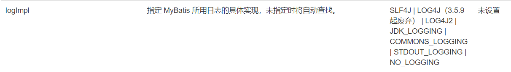

# 附录

## 各种依赖

**Mybatis 依赖**

```xml
<!--Mybatis依赖-->
<!-- https://mvnrepository.com/artifact/org.mybatis/mybatis -->
<dependency>
    <groupId>org.mybatis</groupId>
    <artifactId>mybatis</artifactId>
    <version>3.5.10</version>
</dependency>
```

**MySql 驱动依赖**

```xml
<!--mysql驱动依赖-->
<!-- https://mvnrepository.com/artifact/mysql/mysql-connector-java -->
<dependency>
    <groupId>mysql</groupId>
    <artifactId>mysql-connector-java</artifactId>
    <version>8.0.30</version>
</dependency>
```

**junit 依赖**

```xml
<!-- https://mvnrepository.com/artifact/junit/junit -->
<dependency>
    <groupId>junit</groupId>
    <artifactId>junit</artifactId>
    <version>4.13.2</version>
    <scope>test</scope>
</dependency>
```

**logback 依赖**

```xml
<!-- https://mvnrepository.com/artifact/ch.qos.logback/logback-classic -->
<dependency>
    <groupId>ch.qos.logback</groupId>
    <artifactId>logback-classic</artifactId>
    <version>1.2.11</version>
    <scope>test</scope>
</dependency>
```

# 一、MyBatis 概述

MyBatis 是持久层框架。

JDBC 不足：

- sql 语句写死在 java 代码中

ORM 思想：对象关系映射

- O：Object，对象
- R：Relational，关系型数据库
- M：Mapping，映射


一条记录对应一个 java 对象。

MyBatis 就是一个 ORM 框架，可以实现记录与 java 对象的转换。半自动 ORM 框架，sql 语句需要程序员自己编写。Hibernate 就是全自动 ORM 框架。

# 二、Mybatis 入门程序

## 1、开发步骤

**建表**


**在 IDEA 中新建工程**


配置 JDK 和设置 Maven。

**新建模块**


>
>
>resources 中一般放资源文件、配置文件。直接放到该目录下的资源等同于放到了类的根目录下。

**设置打包方式**

打包方式为 jar，需要部署到 Tomcat 服务器上则打包方式为 war。


```xml
<!--打包方式-->
<packaging>jar</packaging>
```

**引入依赖**

- mybatis 依赖
- mysql 驱动依赖

先添加一个 `dependencies` 标签，再复制依赖。

```xml
<!--Mybatis依赖-->
<!-- https://mvnrepository.com/artifact/org.mybatis/mybatis -->
<dependency>
    <groupId>org.mybatis</groupId>
    <artifactId>mybatis</artifactId>
    <version>3.5.10</version>
</dependency>


<!--mysql驱动依赖-->
<!-- https://mvnrepository.com/artifact/mysql/mysql-connector-java -->
<dependency>
    <groupId>mysql</groupId>
    <artifactId>mysql-connector-java</artifactId>
    <version>8.0.30</version>
</dependency>
```

**编写 MyBatis 核心配置文件**

通用名称：mybatis-config.xml

> 只要知道通过该文件创建 SqlSessionFactory 对象。

```xml
<?xml version="1.0" encoding="UTF-8" ?>
<!DOCTYPE configuration
  PUBLIC "-//mybatis.org//DTD Config 3.0//EN"
  "https://mybatis.org/dtd/mybatis-3-config.dtd">
<configuration>
  <environments default="development">
    <environment id="development">
      <transactionManager type="JDBC"/>
      <dataSource type="POOLED">
        <property name="driver" value="${driver}"/>
        <property name="url" value="${url}"/>
        <property name="username" value="${username}"/>
        <property name="password" value="${password}"/>
      </dataSource>
    </environment>
  </environments>
  <mappers>
    <mapper resource="org/mybatis/example/BlogMapper.xml"/>
  </mappers>
</configuration>
```

> mybatis 有两个核心配置文件：一个是 mybatis-config.xml，配置连接数据库信息（一个）；另一个是 xxxMapper.xml，专门用来编写 sql 语句（一个表一个）。

修改模板中的连接数据库配置。

**编写 xxxMapper.xml 文件**

```xml
<?xml version="1.0" encoding="UTF-8" ?>
<!DOCTYPE mapper
  PUBLIC "-//mybatis.org//DTD Mapper 3.0//EN"
  "https://mybatis.org/dtd/mybatis-3-mapper.dtd">
<mapper namespace="org.mybatis.example.BlogMapper">
  <select id="selectBlog" resultType="Blog">
    select * from Blog where id = #{id}
  </select>
</mapper>
```

修改 `namespace` 并添加一个 sql。

```xml
<mapper namespace="fuck_you">
    <insert id="">
        insert into t_car (id, car_num, brand, guide_price, produce_time, car_type)
        values (null, 1101, '宝宝巴士', 30.00, '2022-11-08', '燃油车')
    </insert>
</mapper>
```

> sql 语句没有高亮提示的解决：
>
> 将头部 https 改为 http。
>
> ```xml
> <!DOCTYPE mapper
>         PUBLIC "-//mybatis.org//DTD Mapper 3.0//EN"
>         "http://mybatis.org/dtd/mybatis-3-mapper.dtd">
> ```

**在 mybatis-config.xml 中关联 mapper**

```xml
<mappers>
    <!--自动在类的根路径下查找-->
    <mapper resource="carMapper.xml"/>
</mappers>
```

**编写 mybatis 程序**

mybatis 中专门执行 sql 语句的是 `sqlSession`。是 Java 程序与数据库之间的一次会话。

从 `sqlSessionFactory` 中获取 `sqlSession` (工厂模式)，而 `sqlSessionFactory` 对象需要使用 `sqlSessionFacotryBuilder` 创建。

mybatis 核心对象：

`sqlSessionFactoryBuilder` --> `sqlSessionFactory` --> `sqlSession`

```java
public static void main(String[] args) throws IOException {
    // 获取 sqlSessionFactoryBuilder 对象
    SqlSessionFactoryBuilder sqlSessionFactoryBuilder = new SqlSessionFactoryBuilder();

    // 获取 sqlSessionFactory 对象，一般是一个数据库对应一个
    // Resources.getResourceAsStream 默认从类的根路径开始查找
    InputStream is = Resources.getResourceAsStream("mybatis-config.xml");
    SqlSessionFactory sqlSessionFactory = sqlSessionFactoryBuilder.build(is);

    // 获取 sqlSession 对象
    SqlSession sqlSession = sqlSessionFactory.openSession();

    // 执行 sql 语句
    int count = sqlSession.insert("insertCar");

    System.out.println(count > 0 ? "插入成功！" : "插入失败！");

    // 手动提交
    sqlSession.commit();
}
```

## 2、小细节

**SQL 语句分号问题**

mybatis 中 sql 语句 `;` 可加可不加。

**配置文件绑定问题**

凡是遇到 `Resources`，大部分是在类的根路径下开始查找，这种方式项目的可移植性很强。自己写的流使用绝对路径进行查找，如果部署到服务器上，还要更改源代码，项目可移植性很差。

使用如下代码也可以从类的根路径下查找资源：

```java
InputStream is = ClassLoader.getSystemClassLoader().getResourceAsStream("mybatis-config.xml");
```

经过源代码分析，mybatis 中 `Resources.getResourceAsStream()` 方法底层调用的就是上述方法。

**核心文件绑定 Mapper 问题**

也可以使用 url 方式进行绑定：

```xml
<mapper url="file:///d:CarMapper.xml"></mapper>
```

但这种方式可移植性差，不建议使用。

**Mybatis 中事务剖析**

在 Mybatis 核心配置文件中，使用 `transactionManager` 标签进行事务管理，例如：

```xml
<transactionManager type="JDBC"/>
```

`transactionManager` 的 `type` 值有两个：

- JDBC
- MANAGED

> 不区分大小写

两种事务管理器：

- JDBC 事务管理器：

  mybatis 自己采用原生 JDBC 管理事务。

  底层创建的事务管理器对象是 JDBC 事务管理器对象。

  在执行 `SqlSession sqlSession = sqlSessionFactory.openSession();` 时，底层会调用 `conn.setAutoCommit(false)`，开启事务。

- MANAGED 事务管理器：

  mybatis 不再负责管理事务，而是交给第三方容器，例如：spring。

  在执行 `SqlSession sqlSession = sqlSessionFactory.openSession();` 时，底层不会调用 `conn.setAutoCommit(false)`，也就不会开启事务。如果没有其他容器对事务进行管理，sql 语句会自动提交。

启发

​	只要 autoCommit 为 True，就表示没有开启事务。

## 3、一个完整的 MyBatis 程序

```java
public static void main(String[] args) {
    SqlSessionFactoryBuilder sqlSessionFactoryBuilder = new SqlSessionFactoryBuilder();
    SqlSession sqlSession = null;
    try {
        SqlSessionFactory sqlSessionFactory = sqlSessionFactoryBuilder.build(Resources.getResourceAsStream("mybatis-config.xml"));
        sqlSession = sqlSessionFactory.openSession(); // 开启事务

        // 执行业务
        int count = sqlSession.insert("insertCar");
        System.out.println(count > 0 ? "添加成功！" : "添加失败");

        // 事务提交
        sqlSession.commit();

    } catch (IOException e) {
        e.printStackTrace();
        // 事务回滚
        sqlSession.rollback();
    } finally {
        // 关闭资源
        if (sqlSession != null) {
            sqlSession.close();
        }
    }
}
```

## 4、Junit 的使用

做单元测试。单元测试类命名规范：测试类 + Test。测试方法名：test + 方法名。

两个重要概念：

- 实际值
- 期待值

使用断言判断实际值与期待值是否相等。

**依赖引入**

```xml
<!-- https://mvnrepository.com/artifact/junit/junit -->
<dependency>
    <groupId>junit</groupId>
    <artifactId>junit</artifactId>
    <version>4.13.2</version>
    <scope>test</scope>
</dependency>
```

**具体编写**

要有呼应关系：


```java
public class UserServiceTest {
    @Test
    public void testSum() {
        UserService userService = new UserService();

        // 实际值
        int actual = userService.sum(1, 2);
        // 期待值
        int expected = 3;
        // 断言判断
        Assert.assertEquals(expected, actual);
    }

    @Test
    public void testSub() {

    }
}
```

每个方法都得到测试。

在 Mybatis 程序中引入 junit。

## 5、MyBatis 中集成日志框架 LogBack

**相关背景**

在 Mybatis 核心配置文件中使用如下标签改变 Mybatis 运行时行为：

```xml
<settings>
    <setting name="" value=""/>
</settings>
```

日志创建相关：



`SLF` 是日志规范，而日志框架 `logback` 实现了 `SLF` 规范。

`STDOUT_LOGGING` 是标准日志，Mybatis 已经实现。

```xml
<settings>
    <setting name="logImpl" value="STDOUT_LOGGING"/>
</settings>
```

**集成步骤**

引入 `logback` 依赖：

```xml
<!-- https://mvnrepository.com/artifact/ch.qos.logback/logback-classic -->
<dependency>
    <groupId>ch.qos.logback</groupId>
    <artifactId>logback-classic</artifactId>
    <version>1.2.11</version>
    <scope>test</scope>
</dependency>
```

引入 `logback` 所必需的 `xml` 文件：

- 名称必须为 `logback.xml` 或 `logback-test.xml`
- 必须放到类根路径下

```xml
<?xml version="1.0" encoding="UTF-8"?>

<!-- 配置文件修改时重新加载，默认true -->
<configuration debug="false">

    <!-- 控制台输出 -->
    <appender name="STDOUT" class="ch.qos.logback.core.ConsoleAppender">
        <encoder class="ch.qos.logback.classic.encoder.PatternLayoutEncoder" charset="UTF-8">
            <!-- 输出日志记录格式 -->
            <pattern>[%thread] %-5level %logger{50} - %msg%n</pattern>
        </encoder>
    </appender>
    
<!--    mybatis log configure-->
    <logger name="com.apache.ibatis" level="TRACE"/>
    <logger name="java.sql.Connection" level="DEBUG"/>
    <logger name="java.sql.Statement" level="DEBUG"/>
    <logger name="java.sql.PreparedStatement" level="DEBUG"/>
    

    <!-- 日志输出级别,LOGBACK日志级别包括五个：TRACE < DEBUG < INFO < WARN < ERROR-->
    <root level="DEBUG">
        <appender-ref ref="STDOUT"/>
        <appender-ref ref="FILE"/>
    </root>
</configuration>
```

使用单元测试就会输出相应信息。

## 6、封装 Mybatis 工具类

一个 `sqlSessionFactory` 对应一个数据库。

```java
public class MybatisUtils {
    private static SqlSessionFactory sqlSessionFactory;

    /**
     * 类加载时，创建 sqlSessionFactory
     */
    static {
        try {
            sqlSessionFactory = new SqlSessionFactoryBuilder().build(Resources.getResourceAsStream("mybatis-config.xml"));
        } catch (IOException e) {
            throw new RuntimeException(e);
        }
    }

    // 构造方法私有化
    private MybatisUtils() {
    }

    /**
     * 开启 sql 会话
     * @return sql 会话
     */
    public static SqlSession openSession() {
        return sqlSessionFactory.openSession();
    }
}
```

# 三、使用 MyBatis 完成 CRUD

首先创建新模块，引入依赖，复制核心配置文件，复制工具类。

实现 CRUD 总体流程，写 sql，写 java。

## 1. 实现 insert

在 Mybatis 中占位符是 `#{}`，相当于 JDBC 中的 `?`。

**使用 Map 传参**

在 `CarMapper.xml` 中设置占位符，使用 Map 传参括号内填入键。

```xml
<insert id="insertCar">
    insert into t_car (id, car_num, brand, guide_price, produce_time, car_type) values (null, #{car_num}, #{brand}, #{guide_price}, #{produce_time}, #{car_type})
</insert>
```

`CarDao.java` 中方法编写：

```java
public void insertCar() {
    SqlSession sqlSession = null;
    Map<String, Object> map = new HashMap<>();
    map.put("car_num", "1102");
    map.put("brand", "特斯拉Model3");
    map.put("guide_price", 30.0);
    map.put("produce_time", "2022-11-09");
    map.put("car_type", "新能源");

    try {
        sqlSession = MybatisUtils.openSession(); // 开启事务

        // 执行业务
        // 第一个参数：sqlId 第二个参数：Object对象
        int count = sqlSession.insert("insertCar", map);
        System.out.println(count > 0 ? "添加成功！" : "添加失败");

        // 事务提交
        sqlSession.commit();

    } catch (Exception e) {
        e.printStackTrace();
        // 事务回滚
        sqlSession.rollback();
    } finally {
        // 关闭资源
        if (sqlSession != null) {
            sqlSession.close();
        }
    }
}
```

**使用 pojo 传参**

编写 pojo 类：

```java
public class Car {
    private Integer id;
    private String carNum;
    private String brand;
    private BigDecimal guidePrice;
    private String produceTime;
    private String carType;
```

`CarDao.java` 中的方法：

```java
public void insertCar() {
    SqlSession sqlSession = null;
    Car car = new Car(null, "1103", "IQOO neo3", BigDecimal.valueOf(20), "2022-11-09", "燃油车");

    try {
        sqlSession = MybatisUtils.openSession(); // 开启事务

        // 执行业务
        int count = sqlSession.insert("insertCar", car);
        System.out.println(count > 0 ? "添加成功！" : "添加失败");

        // 事务提交
        sqlSession.commit();

    } catch (Exception e) {
        e.printStackTrace();
        // 事务回滚
        sqlSession.rollback();
    } finally {
        // 关闭资源
        if (sqlSession != null) {
            sqlSession.close();
        }
    }
}
```

 `CarMapper.xml` 中进行配置：

括号中写的是 pojo 类中的属性(get方法后的就视为一个属性)。

```xml
<insert id="insertCar">
    insert into t_car (id, car_num, brand, guide_price, produce_time, car_type) values (null, #{carNum}, #{brand}, #{guidePrice}, #{produceTime}, #{carType})
</insert>
```

## 2、实现 delete

`CarDao.java` 中 `deleteCarById()`：

```java
public void deleteCarById(Integer id) {
    SqlSession sqlSession = null;

    try {
        sqlSession = MybatisUtils.openSession(); // 开启事务

        // 执行业务
        int count = sqlSession.delete("deleteCarById", id);
        System.out.println(count > 0 ? "删除成功！" : "删除失败");

        // 事务提交
        sqlSession.commit();

    } catch (Exception e) {
        e.printStackTrace();
        // 事务回滚
        sqlSession.rollback();
    } finally {
        // 关闭资源
        if (sqlSession != null) {
            sqlSession.close();
        }
    }
}
```

`CarMapper.xml` 中进行配置：

```xml
<delete id="deleteCarById">
    /*只有一个占位符，大括号内可以随便写*/
    delete from t_car where id = #{id}
</delete>
```

## 3、实现 update

在 `CarMapper.xml` 中写入 sql 语句：

```xml
<update id="updateCarById">
    update t_car set car_num = #{carNum}, brand = #{brand}, guide_price = #{guidePrice}, produce_time = #{produceTime}, car_type = #{carType} where id = #{id}
</update>
```

在 `CarDao.java` 中编写方法 `updateCar()`：

```java
public void updateCar(Car car) {
    SqlSession sqlSession = null;

    try {
        sqlSession = MybatisUtils.openSession(); // 开启事务

        // 执行业务
        int count = sqlSession.update("updateCarById", car);
        System.out.println(count > 0 ? "更新成功！" : "更新失败");

        // 事务提交
        sqlSession.commit();

    } catch (Exception e) {
        e.printStackTrace();
        // 事务回滚
        sqlSession.rollback();
    } finally {
        // 关闭资源
        if (sqlSession != null) {
            sqlSession.close();
        }
    }
}
```

## 4、实现 select

### (1) 查一个

首先在 `CarMapper.xml` 中编写 sql 语句。

使用 Mybatis 中 `selectOne()` 方法可以将查询到的结果封装到对象中，在 `CarMapper.xml` 中指定对象的全类名。

查询到的字段名大概率和属性不匹配，使用 `as` 给列起别名。

> 直接将查询结果封装到 pojo 类中，整合了 dbutils。
>
> 同时，使用 Mybatis 获取连接也是使用连接池方式获取，这是 Druid 的功能。

```xml
<select id="selectById" resultType="pojo.Car">
    select id,
           car_num as carNum,
           brand,
           guide_price as guidePrice,
           produce_time as produceTime,
           car_type as carType
    from t_car
    where id = #{id}
</select>
```

`CarDao.java` 中编写 `queryById()` 方法：

使用到了 `sqlSession.selectOne(sql id, 属性对象) --> Object`。

```java
public Car queryById(Integer id) {
    SqlSession sqlSession = null;
    Car car = null;

    try {
        sqlSession = MybatisUtils.openSession(); // 开启事务

        // 执行业务
        car = sqlSession.selectOne("selectById", id);
    } catch (Exception e) {
        e.printStackTrace();
    } finally {
        // 关闭资源
        if (sqlSession != null) {
            sqlSession.close();
        }
    }

    return car;
}
```

### (2) 查所有

在 `CarMapper.xml` 中编写 sql 语句，指定元素的 pojo 全类名。

```xml
<select id="selectAll" resultType="pojo.Car">
    select id,
           car_num as carNum,
           brand,
           guide_price as guidePrice,
           produce_time as produceTime,
           car_type as carType
    from t_car
</select>
```

在 `CarDao.java` 中编写 `queryAllCars()` 方法：

使用到了 `sqlSession.selectList(sql id, 参数对象) --> List<Object>`。

```java
public List<Car> queryAllCars() {
    SqlSession sqlSession = null;
    List<Car> cars = new ArrayList<>();

    try {
        sqlSession = MybatisUtils.openSession(); // 开启事务

        // 执行业务
        cars = sqlSession.selectList("selectAll");
    } catch (Exception e) {
        e.printStackTrace();
    } finally {
        // 关闭资源
        if (sqlSession != null) {
            sqlSession.close();
        }
    }

    return cars;
}
```

## 5、Mapper 映射文件中 namespace

命名空间可以防止 sql id 冲突。在 java 程序中，使用 namespace.id。

# 四、Mybatis 核心配置文件

```xml
<?xml version="1.0" encoding="UTF-8" ?>
<!--configuration 根标签-->
<!DOCTYPE configuration
        PUBLIC "-//mybatis.org//DTD Config 3.0//EN"
        "https://mybatis.org/dtd/mybatis-3-config.dtd">
<configuration>

    <!--默认使用环境-->
    <environments default="development">
        <!--其中的一个环境，一个环境一般对应一个数据库-->
        <!--一个数据库对应一个 sqlSessionFactory 对象-->
        <!--因此一个环境对应一个 sqlSessionFactory 对象-->
        <environment id="development">
            <transactionManager type="JDBC"/>
            <dataSource type="POOLED">
                <property name="driver" value="com.mysql.cj.jdbc.Driver"/>
                <property name="url" value="jdbc:mysql://localhost:3306/bjpowernode"/>
                <property name="username" value="root"/>
                <property name="password" value="991118"/>
            </dataSource>
        </environment>
    </environments>

    <mappers>
        <!--自动在类的根路径下查找-->
        <mapper resource="carMapper.xml"/>
    </mappers>

</configuration>
```

## 1、环境标签

```xml
<environments default="bjpowernode">
    <environment id="bjpowernode">
        <transactionManager type="JDBC"/>
        <dataSource type="POOLED">
            <property name="driver" value="com.mysql.cj.jdbc.Driver"/>
            <property name="url" value="jdbc:mysql://localhost:3306/bjpowernode"/>
            <property name="username" value="root"/>
            <property name="password" value="991118"/>
        </dataSource>
    </environment>

    <environment id="book">
        <transactionManager type="JDBC"/>
        <dataSource type="POOLED">
            <property name="driver" value="com.mysql.cj.jdbc.Driver"/>
            <!--连接 book 数据库-->
            <property name="url" value="jdbc:mysql://localhost:3306/book"/>
            <property name="username" value="root"/>
            <property name="password" value="991118"/>
        </dataSource>
    </environment>
</environments>
```

新建了一个环境，连接 book 数据库。

在使用 `sqlSessionFactoryBuilder.build(核心配置文件流, 环境名)`，如下所示：

```java
// 默认数据库对应的 sqlSessionFactory
SqlSessionFactory sqlSessionFactory = sqlSessionFactoryBuilder.build(Resources.getResourceAsStream("mybatis-config.xml"));

// 指定数据库对应的 sqlSessionFactory
SqlSessionFactory sqlSessionFactory1 = sqlSessionFactoryBuilder.build(Resources.getResourceAsStream("mybatis-config.xml"), "book");
```

## 2、事务管理器

## 3、数据源

`dataSource` 标签为程序提供 `Connection` 对象。

数据源实际上是一套规范，JDK 中有这一套规范：`javax.sql.DataSource`。

```xml
<dataSource type="POOLED">
    <property name="driver" value="com.mysql.cj.jdbc.Driver"/>
    <property name="url" value="jdbc:mysql://localhost:3306/bjpowernode"/>
    <property name="username" value="root"/>
    <property name="password" value="991118"/>
</dataSource>
```

`type` 属性指定数据源类型，有三个值：`UNPOOLED`/`POOLED`/`JNDI`。

`unpooled`：不使用数据库连接池，每次都是创建新的连接对象。

`pooled`：使用 Mybatis 自身实现的数据库连接池，从池中获取连接对象。

`JNDI`：集成第三方数据库连接池。

JNDI(Java 命名目录接口)是一套规范，大部分 web 容器都实现了 JNDI 规范。

**连接池的使用**

使用连接池可以设置很多参数，这些参数设计的优劣影响连接池的使用效果。参数设置需要不断测试找到最优解。

`poolMaximumActiveConnections` 参数：在任意时间可存在的活动（正在使用）连接数量，默认值：10。

```xml
<property name="poolMaximumActiveConnections" value="10"/>
```

`poolMaximumCheckoutTime` 参数： 在被强制返回之前，池中连接被检出（checked out）时间，默认值：20000 毫秒（即 20 秒）。

`poolMaximumIdleConnections` 参数：最多存在的空闲连接数。如果超出，将关闭多余空闲连接。

## 4、properties 标签与配置

配置 Mybatis 的属性。properties 标签一般不在 Mybatis 核心配置文件中书写，而是书写额外的 properties 文件。

properties 文件：

```properties
driver=com.mysql.cj.jdbc.Driver
urlForBjpowernode=jdbc:mysql://localhost:3306/bjpowernode
username=root
password=991118
```

在核心配置文件中引入 properties 文件，并使用 properties 文件中的键值属性。

```xml
<properties resource="jdbc.properties"></properties>
```

```xml
<environments default="bjpowernode">
    <environment id="bjpowernode">
        <transactionManager type="JDBC"/>
        <dataSource type="POOLED">
            <property name="driver" value="${driver}"/>
            <property name="url" value="${urlForBjpowernode}"/>
            <property name="username" value="${username}"/>
            <property name="password" value="${password}"/>
        </dataSource>
    </environment>
```
