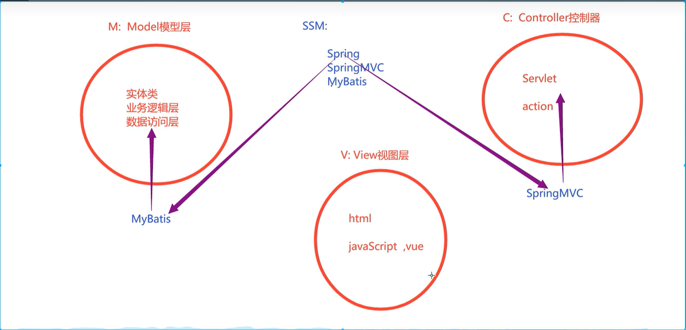
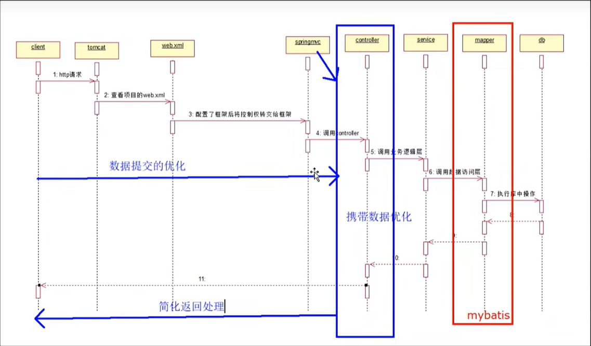
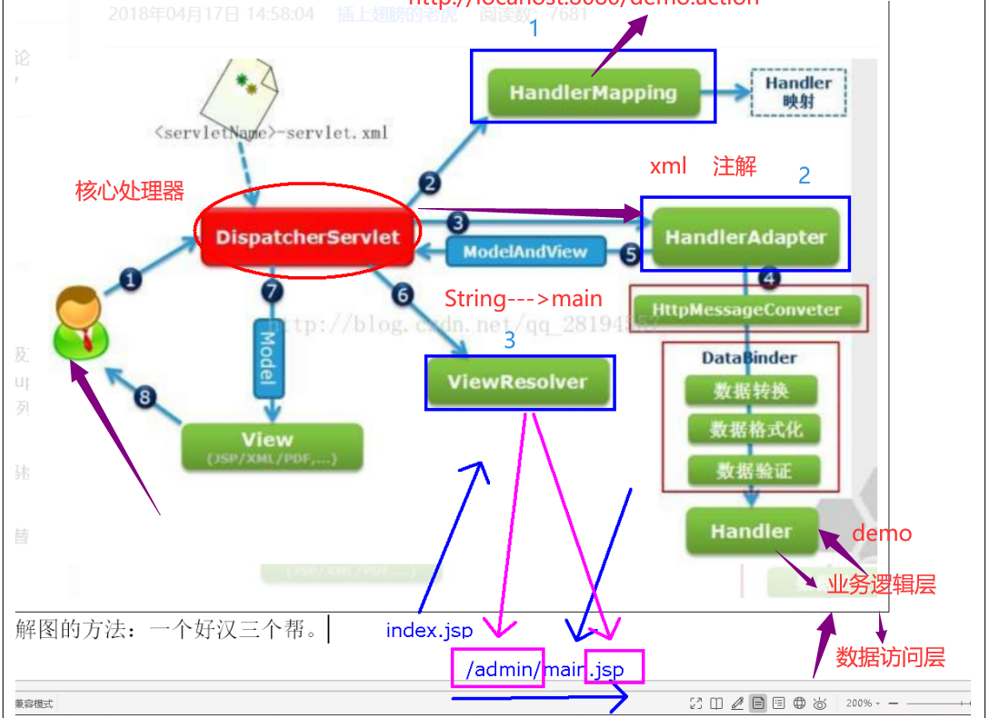
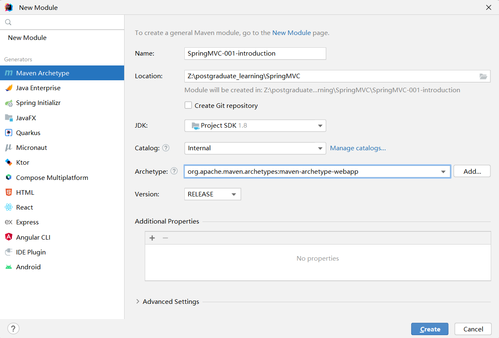
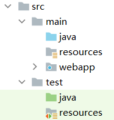
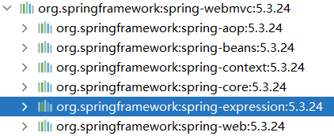
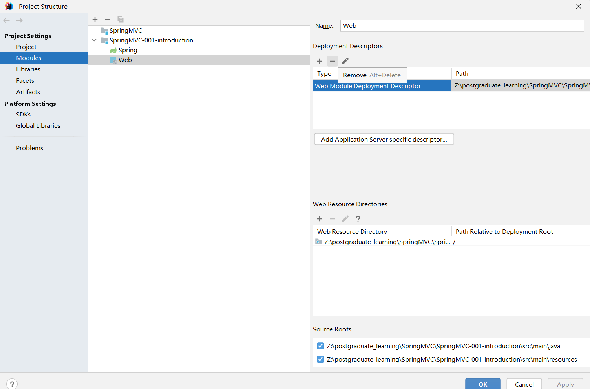
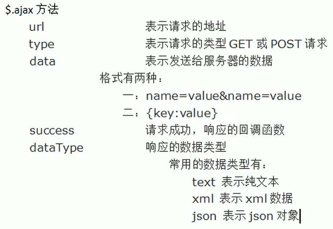
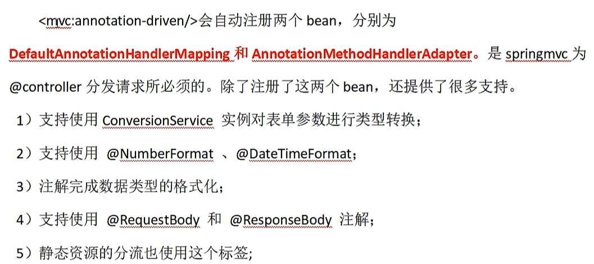
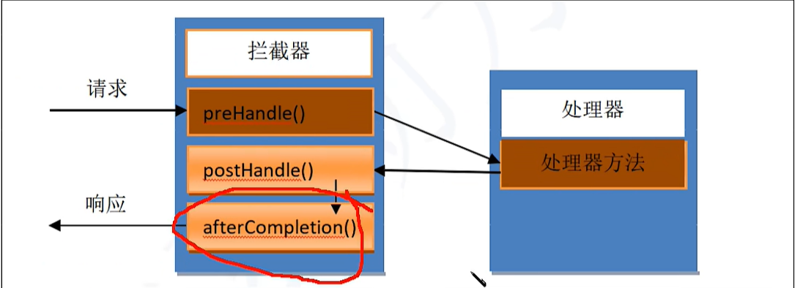

# 依赖

## SpringMVC

```xml
<!-- https://mvnrepository.com/artifact/org.springframework/spring-webmvc -->
<dependency>
    <groupId>org.springframework</groupId>
    <artifactId>spring-webmvc</artifactId>
    <version>5.3.24</version>
</dependency>
```

## Servlet

```xml
<!-- https://mvnrepository.com/artifact/javax.servlet/javax.servlet-api -->
<dependency>
    <groupId>javax.servlet</groupId>
    <artifactId>javax.servlet-api</artifactId>
    <version>3.1.0</version>
    <scope>provided</scope>
</dependency>
```

## jackson

```xml
<!-- https://mvnrepository.com/artifact/com.fasterxml.jackson.core/jackson-databind -->
<dependency>
    <groupId>com.fasterxml.jackson.core</groupId>
    <artifactId>jackson-databind</artifactId>
    <version>2.14.1</version>
</dependency>
```

# 一、SpringMVC 介绍

优化控制器。

MVC

- M：Model，模型层，实体类、业务逻辑层、持久层
- V：View，视图层，前端
- C：Controller，控制器，servlet 程序

SSM 优化方向



SpringMVC 对控制层的优化



SpringMVC 执行流程



# 二、第一个 SpringMVC

## 2.1 步骤

创建空项目。

配置 Maven 和 SDK。

新建模块，使用 Maven Archetype。



修改目录结构



修改 `POM.xml`

修改编译器版本。

添加 servelt 和 SpringMVC 依赖。

引入 SpringMVC 依赖后会关联引入如下依赖：



因此不需要额外引入 Spring-context 依赖。

给 Maven 指定能够获取的配置文件。

```xml
<build>
    <!--指定 Maven 读取的配置文件-->
    <resources>
        <resource>
            <directory>src/main/java</directory>
            <includes>
                <include>**/*.xml</include>
                <include>**/*.properties</include>
            </includes>
        </resource>

        <resource>
            <directory>src/main/resources</directory>
            <includes>
                <include>**/*.xml</include>
                <include>**/*.properties</include>
            </includes>
        </resource>
    </resources>
</build>
```

添加 `springmvc.xml` 配置文件

配置扫描器和视图解析器

```xml
<!--配置扫描器-->
<context:component-scan base-package="com.zzy.intro.controller"/>

<!--配置视图解析器-->
<bean class="org.springframework.web.servlet.view.InternalResourceViewResolver">
    <!--配置前缀-->
    <property name="prefix" value="/admin/"/>

    <!--配置后缀-->
    <property name="suffix" value=".jsp"/>
</bean>
```

>分析 SpringMVC 框架中 web 请求的处理：
>
>​						                     核心处理器
>
>  index.jsp<--------------->DispatcherServlet<------------------->SpringMVC的处理器是一个普通的方法
>  one.jsp  <--------------->DispatcherServlet<------------------->SpringMVC的处理器是一个普通的方法
>
>DispatcherServlet 需要在 `web.xml` 中注册才可以使用。

在 `web.xml` 中注册 `DispatcherServlet` 

使用更新版本的 `web.xml`

删除并添加新的



需要配置 `DispatcherServlet` 需要拦截哪些请求、Spring  容器配置文件的位置

```xml
<!--配置 DispatcherServlet-->
<servlet>
    <servlet-name>dispatcherServlet</servlet-name>
    <servlet-class>org.springframework.web.servlet.DispatcherServlet</servlet-class>
    <init-param>
    	<param-name>contextConfigLocation</param-name>
        <param-value>classpath:springmvc.xml</param-value>
    </init-param>
</servlet>

<servlet-mapping>
    <servlet-name>dispatcherServlet</servlet-name>
    <!--
        拦截哪些请求
    -->
    <url-pattern>*.action</url-pattern>
</servlet-mapping>
```

创建 `index.jsp` 

```jsp
<body>
    <!--使用 .action 后缀以便请求可以被 DispatcherServlet 拦截-->
    <a href="${pageContext.request.contextPath}/demo.action">访问服务器</a>
</body>
```

创建 controller 层中的控制程序

```java
@Controller // 纳入 Spring 容器管理
public class DemoAction {
    /**
     * 方法规范：
     *  修饰符必须为 public，其他可以随意
     */
    @RequestMapping("/demo") // 方法的访问路径
    public String demo() {
        return "main";
    }
}
```

配置 Tomcat 服务器

> 运行 bug 及解决
>
> 如果 `@RequestMapping("/demo")` 不加后缀，则无法访问这个方法。
>
> 必须使用 `@RequestMapping("/demo.action")` 才可以访问

# 三、SpringMVC 注解式开发

## 3.1 `@RequestMapping` 注解

`@requestMapping` 注解可以放到类或者方法上，为类或方法配置**请求的访问路径**，在前端页面便可以像访问文件夹中的文件一样访问类中的方法。类 —— 包，方法 —— 文件。

使用案例：

Controller 层：

```java
@Controller // 纳入 Spring 容器管理
@RequestMapping("/user")
public class DemoAction {
    /**
     * 方法规范：
     *  修饰符必须为 public，其他可以随意
     */
    @RequestMapping("/demo.action") // 方法的访问路径
    public String demo() {
        return "main";
    }
}
```

前端页面：

```jsp
<a href="${pageContext.request.contextPath}/user/demo.action">访问服务器</a>
```

该注解可以区分 get 和 post 请求，使用范例：

```java
@RequestMapping(value = "/req.action", method = RequestMethod.GET) // 请求路径映射
public String reqDoGet() {
    return "get";
}
```

## 3.2 四种数据提交与接收方式

### 3.2.1 单个数据提交

**前端页面**

```jsp
<%--单个数据提交--%>
<form action="${pageContext.request.contextPath}/one.action">
    姓名<input type="text" name="name">
    年龄<input type="text" name="age">
    <input type="submit" value="提交">
</form>
```

**后端接收**

```java
@RequestMapping("/one.action")
public String one(String name, int age) {
    System.out.println(name + "事" + age + "岁");
    return "success";
}
```

> SpringMVC 框架负责参数 name 和 age 的参数转换和赋值。

如果前后端请求参数变量不一致，可以使用 `@RequestParam` 注解解决。

```java
@RequestMapping("/one.action")
public String one(@RequestParam("name") String name, @RequestParam("age") int age) {
    System.out.println(name + "事" + age + "岁");
    return "success";
}
```

### 3.2.2 数据封装提交

接收到数据后，直接封装成对象。

**前端页面**

```jsp
<%--数据封装提交--%>
<form  action="${pageContext.request.contextPath}/two.action">
    姓名<input type="text" name="name">
    年龄<input type="text" name="age">
    <input type="submit" value="提交">
</form>
```

**后端接收**

```java
@RequestMapping("/two.action")
public String two(User user) {
    System.out.println(user);
    return "success";
}
```

### 3.2.3 动态占位符提交

仅限于超链接或地址栏提交数据。前端一杠一参数，后端一杠一大括号，使用注解注入。

**前端页面**

```jsp
<%--动态占位符提交--%>
<a href="${pageContext.request.contextPath}/three/田所浩二/24.action">蟹蟹♂</a>
```

**后端接收**

```java
@RequestMapping("/three/{name}/{age}.action")
public String three(@PathVariable("name") String name, @PathVariable("age") int age) {
    System.out.println(name + "事" + age + "岁");
    return "success";
}
```

### 3.2.4 手工提取数据【曾经的方法】

`request.getParameter()`

## 3.3 中文乱码解决方案

在 `web.xml` 中配置过滤器，将所有请求与响应强制转换编码方式为 UTF-8。

```xml
<!--配置解决中文乱码的过滤器-->
<filter>
    <filter-name>encode</filter-name>
    <filter-class>org.springframework.web.filter.CharacterEncodingFilter</filter-class>
    <!--
      配置参数
        private String encoding;
        private boolean forceRequestEncoding;
        private boolean forceResponseEncoding;
    -->
    <init-param>
        <param-name>encoding</param-name>
        <param-value>UTF-8</param-value>
    </init-param>
    <init-param>
        <param-name>forceRequestEncoding</param-name>
        <param-value>true</param-value>
    </init-param>
    <init-param>
        <param-name>forceResponseEncoding</param-name>
        <param-value>true</param-value>
    </init-param>
</filter>
<filter-mapping>
    <filter-name>encode</filter-name>
    <url-pattern>/*</url-pattern>
</filter-mapping>
```

## 3.4 action 方法的返回值

**String**

拼接前缀和后缀成为客户端资源的返回地址。在 SpringMVC 配置文件中配置视图解析器便可以方便地进行跳转。

**Object**

返回json格式的对象。自动将对象或集合转为json，使用的jackson工具进行转换，必须要添加jackson依赖。一般用于ajax请求。

**void**

一般用于 ajax 请求。

**基本数据类型**

一般用于 ajax 请求。

## 3.5 AJAX 请求实例

前端点击

搭建项目基本流程：

Pom 文件 --> 目录搭建 --> SpringMVC 配置文件 --> web.xml 配置文件

**SprimgMVC 配置文件**

```xml
<!--配置包扫描-->
<context:component-scan base-package="com.zzy.ajax.controller"/>

<!--无需配置视图解析器-->

<!--配置注解驱动-->
<mvc:annotation-driven/>
```

**`web.xml` 配置文件**

`web.xml` 中配置解决中文乱码问题的过滤器和 DispatcherServlet。

**前端 ajax 请求**

`index.jsp`

```jsp
<%--
  Created by IntelliJ IDEA.
  User: 24211
  Date: 2022/12/6
  Time: 10:32
  To change this template use File | Settings | File Templates.
--%>
<%@ page contentType="text/html;charset=UTF-8" language="java" %>

<html>
<head>
    <title>ajax请求</title>
    <%--导入 jQuery 函数库--%>
    <script type="text/javascript" src="js/jquery-3.6.1.js"></script>
</head>
<body>
    <a href="javascript:showstu()">请求获取集合</a>
    <br>
    <div id="data_div">等待服务器数据</div>
</body>

<script type="text/javascript">
    function showstu() {
        $.ajax({
            url: "${pageContext.request.contextPath}/list.action",
            type: "get",
            dataType: "json",
            success: function (stu_list) {
                // alert(stu_list);
                var s = "";
                $.each(stu_list, function (i, stu) {
                    s += stu.name + "---" + stu.age + "<br>";
                });
                // 数据显示
                $("#data_div").html(s);
            }
        })
    }
</script>
</html>
```

> 注意点
>
> 1. 导入 js 必须使用 `<script type="text/javascript" src="js/jquery-3.6.1.js"></script>` ，不能使用 `<script type="text/javascript" src="js/jquery-3.6.1.js"/>`。
>
> 2. JQuery 发送 ajax 请求
>
>    

**后端处理**

`StudentController.java`

```java
@Controller
public class StudentController {
    @RequestMapping("list.action")
    @ResponseBody // 专门处理 ajax 请求
    public List<Student> showStu() {
        List<Student> students = new ArrayList<>();
        students.add(new Student("田所浩二", 24));
        students.add(new Student("德川", 22));
        return students; // 返回值为 Object，自动封装为 json
    }
}
```

## 3.6 SpringMVC 的四种跳转方式

> 在 JavaWeb 中接触到的跳转方式有请求转发和重定向。

SpringMVC 中基本方式也是这两种，区别在于 SpringMVC 可以跳转到其他 action。

### 3.6.1 请求转发

直接请求转发到另一个页面不再赘述。

请求转发到另一个 controller 程序时，可以使用 `:forward` 屏蔽视图解析器中的前缀和后缀的值。

```java
@RequestMapping("two.action")
public String jump2() {
    return "forward:other.action";
}
```

### 3.6.2 重定向

使用 `:redirect` 进行重定向，也可以屏蔽视图解析器中的前缀与后缀。

```java
@RequestMapping("/three.action")
public String jump3() {
    return "redirect:/admin/main.jsp";
}

@RequestMapping("/four.action")
public String jump4() {
    return "redirect:/other.action";
}
```

## 3.7 SpringMVC 支持的默认参数类型

> 即 action 方法的参数。`public String jump3(参数)`

下面这些参数不需要创建，直接可以使用：

- HttpServletResponse
- HttpServletRequest
- HttpSession
- Model
- Map
- ModelMap

注意：Model、Map 和 ModelMap 使用请求作用域进行传参。

**Controller** 

```java
@Controller
public class DataAction {
    @RequestMapping("/five.action")
    public String jump(HttpServletRequest request,
                       HttpServletResponse response,
                       HttpSession session,
                       Model model,
                       Map map,
                       ModelMap modelMap) {
        User user = new User("田所浩二", "114514");
        request.setAttribute("request", user);
        session.setAttribute("session", user);
        model.addAttribute("model", user);
        map.put("map", user);
        modelMap.addAttribute("modelMap", user);
        return "main"; // 默认使用请求转发方式
    }
}
```

**前端显示**

```jsp
request:${requestScope.request}<br>
session:${sessionScope.session}<br>
model:${model}<br>
map:${map}<br>
modelMap:${modelMap}<br>
```

## 3.8 日期处理

### 3.8.1 日期提交

**前端页面**

```jsp
<form action="${pageContext.request.contextPath}/date.action">
    请输入日期：<input type="date" name="date">
    <input type="submit" value="提交">
</form>
```

> 使用 `<input type="date" name="date">` 提交日期。

**Controller**

```java
@Controller
public class DateAction {
    @RequestMapping("/date.action")
    public String getDate(@DateTimeFormat(pattern = "yyyy-MM-dd") Date date,
                          HttpServletRequest request) {
        request.setAttribute("date", date);
        return "main";
    }
}
```

> 使用注解 `@DateTimeFormat` 将前端传来的日期转换为的 `Date` 对象，要使用此注解，需要在 `SpringMVC.xml` 中配置注解驱动。
>
> pattern 中填写的是前端传来日期的格式。

存在的问题：如果前端页面传来多个日期，每个都要使用 `@DateTimeFormat` 注解太麻烦。

可以使用全局日期处理注解。

```java
private SimpleDateFormat sdf = new SimpleDateFormat("yyyy-MM-dd");

@InitBinder
public void initBinder(WebDataBinder dataBinder){
    dataBinder.registerCustomEditor(Date.class,new CustomDateEditor(sdf,true));
}
```

### 3.8.2 日期显示

使用 JSTL，需要使用的话上网查询。

## 3.9 `<mvc:annotation-driven/>` 注解驱动标签




## 3.10 资源在 `WEB-INF` 目录下

此目录下的资源，不可直接访问，只能通过请求转发的方式进行访问。

## 3.11 SpringMVC 拦截器

针对请求与响应进行额外处理。包括预处理、后处理和最终处理。



拦截器执行时机：

- `preHandle()`：请求处理之前。
- `postHandel()`：请求处理之后，还没有传给客户端。
- `afterCompletion()`：所有请求响应结束之后的善后工作。

拦截器实现的两种方式：

- 继承父类：`HandlerInterceptorAdapter`
- 实现接口：`HandlerInterceptor`

> 优先使用实现接口方式，java 只能使用单继承。

拦截器实现步骤：

1. 登录成功后，将用户信息存入 Session 域中。

2. 开发拦截器，若 Sessoin 域中存在登录信息，放行。

   `HandlerInterceptor` 接口中 `preHandle()` 方法返回值为布尔型，专门用来权限验证。

   ```java
       default boolean preHandle(HttpServletRequest request, HttpServletResponse response, Object handler) throws Exception {
           return true; // 默认放行
       }
   ```

3. 在 SpringMVC 配置文件中注册拦截器

   拦截哪些请求、放行哪些请求以及实现功能的类。

   ```xml
     	<mvc:interceptors>
           <mvc:interceptor>
               <!--映射要拦截的请求-->
               <mvc:mapping path="/**"/>
               <!--设置放行的请求-->
               <mvc:exclude-mapping path="/showLogin"></mvc:exclude-mapping>
               <mvc:exclude-mapping path="/login"></mvc:exclude-mapping>
               <!--配置具体的拦截器实现功能的类-->
               <bean class="com.bjpowernode.interceptor.LoginInterceptor"></bean>
           </mvc:interceptor>
       </mvc:interceptors>
   ```

# 四、SSM 整合

新建项目。

补充目录。

修改 POM 文件。

```xml
<?xml version="1.0" encoding="UTF-8"?>

<project xmlns="http://maven.apache.org/POM/4.0.0" xmlns:xsi="http://www.w3.org/2001/XMLSchema-instance"
         xsi:schemaLocation="http://maven.apache.org/POM/4.0.0 http://maven.apache.org/xsd/maven-4.0.0.xsd">
    <modelVersion>4.0.0</modelVersion>

    <groupId>com.zzy</groupId>
    <artifactId>SpringMVC-005-SSM</artifactId>
    <version>1.0</version>
    <packaging>war</packaging>

    <name>SpringMVC-005-SSM Maven Webapp</name>
    <!-- FIXME change it to the project's website -->
    <url>http://www.example.com</url>

    <!-- 集中定义依赖版本号 -->
    <properties>
        <!--单元测试的依赖-->
        <junit.version>4.13.2</junit.version>
        <!--spring的相关依赖-->
        <spring.version>5.3.24</spring.version>
        <!--mybatis的相关依赖-->
        <mybatis.version>3.5.10</mybatis.version>
        <!--mybaits与spring整合的依赖-->
        <mybatis.spring.version>2.0.0</mybatis.spring.version>
        <!--mybatis支持的分页插件的依赖-->
        <mybatis.paginator.version>1.2.15</mybatis.paginator.version>
        <!--mysql的依赖-->
        <mysql.version>8.0.30</mysql.version>
        <!--slf4j日志依赖-->
        <slf4j.version>1.6.4</slf4j.version>
        <!--阿里的数据库连接池-->
        <druid.version>1.2.8</druid.version>
        <!--分页插件的依赖-->
        <pagehelper.version>5.3.1</pagehelper.version>
        <!--JSTL的依赖(jsp的标准标签库)-->
        <jstl.version>1.2</jstl.version>
        <!--servlet的依赖-->
        <servlet-api.version>3.1.0</servlet-api.version>
        <!--jsp的依赖-->
        <jsp-api.version>2.0</jsp-api.version>
        <!--jackson的依赖,springmvc框架默认进行JSON转换的依赖工具-->
        <jackson.version>2.14.1</jackson.version>
    </properties>


    <dependencies>
        <!-- spring -->
        <dependency>
            <groupId>org.springframework</groupId>
            <artifactId>spring-context</artifactId>
            <version>${spring.version}</version>
        </dependency>
        <dependency>
            <groupId>org.springframework</groupId>
            <artifactId>spring-beans</artifactId>
            <version>${spring.version}</version>
        </dependency>
        <dependency>
            <groupId>org.springframework</groupId>
            <artifactId>spring-webmvc</artifactId>
            <version>${spring.version}</version>
        </dependency>
        <dependency>
            <groupId>org.springframework</groupId>
            <artifactId>spring-jdbc</artifactId>
            <version>${spring.version}</version>
        </dependency>
        <dependency>
            <groupId>org.springframework</groupId>
            <artifactId>spring-aspects</artifactId>
            <version>${spring.version}</version>
        </dependency>
        <dependency>
            <groupId>org.springframework</groupId>
            <artifactId>spring-jms</artifactId>
            <version>${spring.version}</version>
        </dependency>
        <dependency>
            <groupId>org.springframework</groupId>
            <artifactId>spring-context-support</artifactId>
            <version>${spring.version}</version>
        </dependency>
        <dependency>
            <groupId>org.springframework</groupId>
            <artifactId>spring-test</artifactId>
            <version>${spring.version}</version>
        </dependency>
        <!-- Mybatis -->
        <dependency>
            <groupId>org.mybatis</groupId>
            <artifactId>mybatis</artifactId>
            <version>${mybatis.version}</version>
        </dependency>
        <dependency>
            <groupId>org.mybatis</groupId>
            <artifactId>mybatis-spring</artifactId>
            <version>${mybatis.spring.version}</version>
        </dependency>
        <dependency>
            <groupId>com.github.miemiedev</groupId>
            <artifactId>mybatis-paginator</artifactId>
            <version>${mybatis.paginator.version}</version>
        </dependency>
        <dependency>
            <groupId>com.github.pagehelper</groupId>
            <artifactId>pagehelper</artifactId>
            <version>${pagehelper.version}</version>
        </dependency>
        <!-- MySql -->
        <dependency>
            <groupId>mysql</groupId>
            <artifactId>mysql-connector-java</artifactId>
            <version>${mysql.version}</version>
        </dependency>
        <!-- 连接池 -->
        <dependency>
            <groupId>com.alibaba</groupId>
            <artifactId>druid</artifactId>
            <version>${druid.version}</version>
        </dependency>

        <!-- junit -->
        <dependency>
            <groupId>junit</groupId>
            <artifactId>junit</artifactId>
            <version>${junit.version}</version>
            <scope>test</scope>
        </dependency>


        <!-- JSP相关 -->
        <dependency>
            <groupId>jstl</groupId>
            <artifactId>jstl</artifactId>
            <version>${jstl.version}</version>
        </dependency>
        <dependency>
            <groupId>javax.servlet</groupId>
            <artifactId>javax.servlet-api</artifactId>
            <version>${servlet-api.version}</version>
            <scope>provided</scope>
        </dependency>
        <dependency>
            <groupId>javax.servlet</groupId>
            <artifactId>jsp-api</artifactId>
            <scope>provided</scope>
            <version>${jsp-api.version}</version>
        </dependency>
        <!-- Jackson Json处理工具包 -->
        <dependency>
            <groupId>com.fasterxml.jackson.core</groupId>
            <artifactId>jackson-databind</artifactId>
            <version>${jackson.version}</version>
        </dependency>

    </dependencies>

    <!-- 插件配置 -->
    <build>
        <plugins>
            <plugin>
                <groupId>org.apache.maven.plugins</groupId>
                <artifactId>maven-compiler-plugin</artifactId>
                <configuration>
                    <source>1.8</source>
                    <target>1.8</target>
                    <encoding>UTF-8</encoding>
                </configuration>
            </plugin>
        </plugins>
        <!--识别所有的配置文件-->
        <resources>
            <resource>
                <directory>src/main/java</directory>
                <includes>
                    <include>**/*.properties</include>
                    <include>**/*.xml</include>
                </includes>
                <filtering>false</filtering>
            </resource>
            <resource>
                <directory>src/main/resources</directory>
                <includes>
                    <include>**/*.properties</include>
                    <include>**/*.xml</include>
                </includes>
                <filtering>false</filtering>
            </resource>
        </resources>
    </build>
</project>
```

添加 jdbc.properties 配置文件。

添加 Mybatis 核心配置文件，大部分不需要。

添加 Spring 管理数据访问层配置文件。

```xml
<?xml version="1.0" encoding="UTF-8"?>
<beans xmlns="http://www.springframework.org/schema/beans"
       xmlns:xsi="http://www.w3.org/2001/XMLSchema-instance"
       xmlns:context="http://www.springframework.org/schema/context"
       xsi:schemaLocation="http://www.springframework.org/schema/beans http://www.springframework.org/schema/beans/spring-beans.xsd http://www.springframework.org/schema/context https://www.springframework.org/schema/context/spring-context.xsd">

    <!--引入数据库连接信息-->
    <context:property-placeholder location="classpath:jdbc.properties"/>

    <!--配置数据源-->
    <bean id="dataSource" class="com.alibaba.druid.pool.DruidDataSource">
        <property name="driverClassName" value="${jdbc.driver}"/>
        <property name="url" value="${jdbc.url}"/>
        <property name="username" value="${jdbc.username}"/>
        <property name="password" value="${jdbc.password}"/>
    </bean>

    <!--注册 SqlSessionFactoryBean-->
    <bean class="org.mybatis.spring.SqlSessionFactoryBean">
        <!--数据源-->
        <property name="dataSource" ref="dataSource"/> 
        
        <!--核心配置文件-->
        <property name="configLocation" value="classpath:mybatis-config.xml"/>
        
        <!--给 pojo 类指定别名-->
        <property name="typeAliasesPackage" value="com.zzy.ssm.pojo"/>
    </bean>

    <!--指定mapper包-->
    <bean class="org.mybatis.spring.mapper.MapperScannerConfigurer">
        <property name="basePackage" value="com.zzy.ssm.mapper"/>
    </bean>
</beans>
```

添加 Service 层配置文件。主要是事务管理器。

添加 SpringMVC 配置文件。

```xml
<?xml version="1.0" encoding="UTF-8"?>
<beans xmlns="http://www.springframework.org/schema/beans"
       xmlns:xsi="http://www.w3.org/2001/XMLSchema-instance"
       xmlns:context="http://www.springframework.org/schema/context"
       xmlns:mvc="http://www.springframework.org/schema/mvc"
       xsi:schemaLocation="http://www.springframework.org/schema/beans http://www.springframework.org/schema/beans/spring-beans.xsd http://www.springframework.org/schema/context https://www.springframework.org/schema/context/spring-context.xsd http://www.springframework.org/schema/mvc https://www.springframework.org/schema/mvc/spring-mvc.xsd">

    <!--配置包扫描-->
    <context:component-scan base-package="com.zzy.ssm.controller"/>

    <!--配置注解驱动-->
    <mvc:annotation-driven/>
</beans>
```

web.xml 配置文件。

