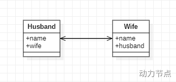

# 依赖

## Spring-context 依赖

```xml
<!--Spring context 依赖-->
<!-- https://mvnrepository.com/artifact/org.springframework/spring-context -->
<dependency>
    <groupId>org.springframework</groupId>
    <artifactId>spring-context</artifactId>
    <version>6.0.0</version>
</dependency>
```

## log4j2 依赖

```xml
<!-- https://mvnrepository.com/artifact/org.apache.logging.log4j/log4j-core -->
<!--log4j-core-->
<dependency>
    <groupId>org.apache.logging.log4j</groupId>
    <artifactId>log4j-core</artifactId>
    <version>2.19.0</version>
</dependency>
<!--log4j-slf4j2-impl-->
<!-- https://mvnrepository.com/artifact/org.apache.logging.log4j/log4j-slf4j2-impl -->
<dependency>
    <groupId>org.apache.logging.log4j</groupId>
    <artifactId>log4j-slf4j2-impl</artifactId>
    <version>2.19.0</version>
    <!--将 test 改为 compile，测试类之外的地方也可以使用-->
    <scope>test</scope>
</dependency>
```

## JDK 扩展包依赖(使用 @Resource)

Spring 6：

```xml
<dependency>
  <groupId>jakarta.annotation</groupId>
  <artifactId>jakarta.annotation-api</artifactId>
  <version>2.1.1</version>
</dependency>
```

Spring 5：

```xml
<dependency>
  <groupId>javax.annotation</groupId>
  <artifactId>javax.annotation-api</artifactId>
  <version>1.3.2</version>
</dependency>
```

# Spring-aspects 依赖

```xml
<!--Spring-aspects 依赖-->
<dependency>
    <groupId>org.springframework</groupId>
    <artifactId>spring-aspects</artifactId>
    <version>6.0.0</version>
</dependency>
```

# 一、框架概述

- 开源轻量级 JavaEE 框架。

- 解决企业应用开发复杂性。

- 两大核心：IOC 和 AOP。
  - IOC：控制反转，把创建对象过程交给 Spring
  - AOP：面向切面，不修改源代码而对功能进行增强

- 特点：
  - 方便解耦，简化开发
  - AOP 支持
  - 方便测试
  - 方便集成各种优秀框架
  - 方便事务管理
  - 降低 API 使用难度
  - 源码是经典学习范例

Spring 5。

**软件要求**

Spring 6、JDK17。

**MVC 架构缺点**

1、违背 OCP 原则

在扩展功能时，Dao 持久层代码修改，Service 层代码也要改。

2、违背依赖倒置 DIP 原则

MVC 架构中，上依赖下，这就不符合依赖倒置原则。

下面修改，上面也会受牵连。


解决措施：“控制反转(IoC：Inversion of Control)”。程序中不再采用硬编码方式 new 对象、不再采用硬编码方式维护对象的关系。

四、Spring 框架

实现了 IoC 这种思想。

控制反转的实现方式有多种，其中比较重要的叫做：依赖注入(Dependency Injection, DI)。

依赖注入的两种方式：

- set 注入（使用 set 方法给属性赋值）
- 构造方法注入（使用构造方法给属性赋值）

对象 A 和对象 B 之间的关系靠注入方式维护。

**Spring 八大模块**


2、Spring 特点

非侵入式：不依赖。

# 二、Spring 入门程序

Spring 中文官网：http://spring.p2hp.com/

## 1、总体流程

**引入依赖**

引入 `Spring-context` 相当于引入了基础依赖。

```xml
<!--Spring context 依赖-->
<!-- https://mvnrepository.com/artifact/org.springframework/spring-context -->
<dependency>
    <groupId>org.springframework</groupId>
    <artifactId>spring-context</artifactId>
    <version>6.0.0</version>
</dependency>
```

会关联其他依赖：


```xml
<!--junit依赖-->
<!-- https://mvnrepository.com/artifact/junit/junit -->
<dependency>
    <groupId>junit</groupId>
    <artifactId>junit</artifactId>
    <version>4.13.2</version>
    <scope>test</scope>
</dependency>
```

**定义 bean**

```java
package com.zzy.introduction.bean;

/**
 * 用户 bean 类
 */
public class User {
}
```

**编写 Spring 配置文件 beans.xml，放在类的根路径下**


```xml
<?xml version="1.0" encoding="UTF-8"?>
<beans xmlns="http://www.springframework.org/schema/beans"
       xmlns:xsi="http://www.w3.org/2001/XMLSchema-instance"
       xsi:schemaLocation="http://www.springframework.org/schema/beans http://www.springframework.org/schema/beans/spring-beans.xsd">

    <!--id 类的标识，不能重复-->
    <!--class 类的全限定名称-->
    <bean id="userBean" class="com.zzy.introduction.bean.User"></bean>
</beans>
```

编写测试程序：

```java
public void testSpring() {
    // 初始化 Spring 容器上下文
    ApplicationContext applicationContext = new ClassPathXmlApplicationContext("beans.xml");
    Object userBean = applicationContext.getBean("userBean");
    System.out.println(userBean);
}
```

## 2、程序剖析

### (1) 创建对象机制

底层使用 dom4j 解析 xml 配置文件，使用反射机制调用**无参构造方法**创建对象。

> 一定要保证无参构造方法的存在。

### (2) 配置文件 beans.xml

配置文件名称自己可以任意指定，并且可以有多个配置文件。

配置文件中的类可以是 JDK 中的类。

### (3) 向下转型问题

```java
User userBean = applicationContext.getBean("userBean", User.class);
```

指定 class 避免向下转型。

### (4) 顶级父接口 BeanFactory

Spring 底层 IoC 实现：XML 解析 + 工厂模式 + 反射机制。

并不是在调用 `getBean()` 方法时创建 bean 对象，只要解析了 xml 文件就会创建对象。

## 3、Spring 启用 Log4j2

**引入依赖**

```xml
<!-- https://mvnrepository.com/artifact/org.apache.logging.log4j/log4j-core -->
<!--log4j-core-->
<dependency>
    <groupId>org.apache.logging.log4j</groupId>
    <artifactId>log4j-core</artifactId>
    <version>2.19.0</version>
</dependency>
<!--log4j-slf4j2-impl-->
<!-- https://mvnrepository.com/artifact/org.apache.logging.log4j/log4j-slf4j2-impl -->
<dependency>
    <groupId>org.apache.logging.log4j</groupId>
    <artifactId>log4j-slf4j2-impl</artifactId>
    <version>2.19.0</version>
    <scope>test</scope>
</dependency>
```

**在类的根路径下提供 log4j2.xml**

```xml
<?xml version="1.0" encoding="UTF-8"?>

<configuration>

    <loggers>
        <!--
            level指定日志级别，从低到高的优先级：
                ALL < TRACE < DEBUG < INFO < WARN < ERROR < FATAL < OFF
        -->
        <root level="DEBUG">
            <appender-ref ref="spring6log"/>
        </root>
    </loggers>

    <appenders>
        <!--输出日志信息到控制台-->
        <console name="spring6log" target="SYSTEM_OUT">
            <!--控制日志输出的格式-->
            <PatternLayout pattern="%d{yyyy-MM-dd HH:mm:ss SSS} [%t] %-3level %logger{1024} - %msg%n"/>
        </console>
    </appenders>

</configuration>
```

**使用日志框架**

```java
public void testLog() {
    Logger logger = LoggerFactory.getLogger(SpringTest.class);
    logger.info("我是一个一个日志信息啊啊啊");
    logger.error("我是一个一个错误信息啊啊啊");
}
```

# 三、Spring 对 IoC 的实现

## 1、控制反转 IoC

控制反转是一种思想。

反转：对象创建的权利交给第三方容器，对象与对象关系的维护交给第三方容器。

Spring 通过依赖注入 DI 实现了控制反转。

## 2、依赖注入

依赖：对象与对象之间的关联关系。

Spring 使用依赖注入进行 bean 管理：bean 对象的创建和 bean 对象属性的赋值(bean 对象之间关系的维护)。

依赖注入实现方式：

- set 注入
- 构造方法注入

### (1) set 注入

基于 set 方法进行注入。

**引入依赖**

```xml
<dependencies>
    <!--Spring context 依赖-->
    <!-- https://mvnrepository.com/artifact/org.springframework/spring-context -->
    <dependency>
        <groupId>org.springframework</groupId>
        <artifactId>spring-context</artifactId>
        <version>6.0.0</version>
    </dependency>

    <dependency>
        <groupId>junit</groupId>
        <artifactId>junit</artifactId>
        <version>4.13.2</version>
        <scope>test</scope>
    </dependency>
    
    
</dependencies>
```

**`UserDao`**

```java
public class UserDao {
    // 日志对象
    private static final Logger logger = LoggerFactory.getLogger(UserDao.class);

    public void insert() {
        logger.info("用户数据插入成功！");
    }
}
```

**`UserService`**

在 IDEA 中 `setUserDao()` 方法旁边有如下标识：

 

说明 Spring 会将 `set` 方法后的标识符视为属性。

```java
public class UserService {
    private UserDao userDao;

    public void setUserDao(UserDao userDao) {
        this.userDao = userDao;
    }

    public void insertUser() {
        userDao.insert();
    }
}
```

**编写 `beans.xml` 配置文件**

```xml
<!--配置 UserDao-->
<bean id="userDao" class="com.zzy.DI.dao.UserDao"></bean>

<!--配置 UserService-->
<bean id="userService" class="com.zzy.DI.service.UserService">
    <property name="userDao" ref="userDao"></property>
</bean>
```

**测试程序**

```java
public void testInsertUser() {
    // 启用 Spring 容器
    ApplicationContext applicationContext = new ClassPathXmlApplicationContext("beans.xml");
    // 获取 bean 对象
    UserService userService = applicationContext.getBean("userService", UserService.class);
    userService.insertUser();
}
```

### (2) 构造方法注入

`MyService.java`

```java
public class MyService {
    private UserDao userDao;
    private VipDao vipDao;

    public MyService(UserDao userDao, VipDao vipDao) {
        this.userDao = userDao;
        this.vipDao = vipDao;
    }

    public void insertAll() {
        userDao.insert();
        vipDao.insert();
    }
}
```

`beans.xml`

```xml
<!--配置 MyService-->
<bean id="myService" class="com.zzy.DI.service.MyService">
    <constructor-arg index="0" ref="userDao"/>
    <constructor-arg index="1" ref="vipDao"/>
</bean>
```

## 3、Set 注入专题

### (1) 内部 bean 与外部 bean

外部 bean：

```xml
<?xml version="1.0" encoding="UTF-8"?>
<beans xmlns="http://www.springframework.org/schema/beans"
       xmlns:xsi="http://www.w3.org/2001/XMLSchema-instance"
       xsi:schemaLocation="http://www.springframework.org/schema/beans http://www.springframework.org/schema/beans/spring-beans.xsd">

    <bean id="userDaoBean" class="com.powernode.spring6.dao.UserDao"/>

    <bean id="userServiceBean" class="com.powernode.spring6.service.UserService">
        <property name="userDao" ref="userDaoBean"/>
    </bean>

</beans>
```

内部 bean：

```xml
<?xml version="1.0" encoding="UTF-8"?>
<beans xmlns="http://www.springframework.org/schema/beans"
       xmlns:xsi="http://www.w3.org/2001/XMLSchema-instance"
       xsi:schemaLocation="http://www.springframework.org/schema/beans http://www.springframework.org/schema/beans/spring-beans.xsd">

    <bean id="userServiceBean" class="com.powernode.spring6.service.UserService">
        <property name="userDao">
            <bean class="com.powernode.spring6.dao.UserDao"/>
        </property>
    </bean>

</beans>
```

> 小技巧：Ctrl + F12 查询类中的方法和属性。

### (2) 简单类型注入

Spring 视下面的类型为简单类型：


使用代码：

```xml
<?xml version="1.0" encoding="UTF-8"?>
<beans xmlns="http://www.springframework.org/schema/beans"
       xmlns:xsi="http://www.w3.org/2001/XMLSchema-instance"
       xsi:schemaLocation="http://www.springframework.org/schema/beans http://www.springframework.org/schema/beans/spring-beans.xsd">
    <bean id="userBean" class="com.powernode.spring6.beans.User">
        <!--如果像这种int类型的属性，我们称为简单类型，这种简单类型在注入的时候要使用value属性，不能使用ref-->
        <!--<property name="age" value="20"/>-->
        <property name="age">
            <value>20</value>
        </property>
    </bean>
</beans>
```

并不会使用这种方法给实体类对象赋值，实体类对象的赋值会交由持久层框架进行。

**经典案例**

Spring 管理数据源：

```xml
<?xml version="1.0" encoding="UTF-8"?>
<beans xmlns="http://www.springframework.org/schema/beans"
       xmlns:xsi="http://www.w3.org/2001/XMLSchema-instance"
       xsi:schemaLocation="http://www.springframework.org/schema/beans http://www.springframework.org/schema/beans/spring-beans.xsd">
  
    <bean id="dataSource" class="com.powernode.spring6.beans.MyDataSource">
        <property name="driver" value="com.mysql.cj.jdbc.Driver"/>
        <property name="url" value="jdbc:mysql://localhost:3306/spring"/>
        <property name="username" value="root"/>
        <property name="password" value="123456"/>
    </bean>
  
</beans>
```

配置信息也是写到了配置文件中，没有写死到程序里。

### (3) 级联属性赋值（了解）

`Clazz.java`

```java
package com.powernode.spring6.beans;

/**
 * @author 动力节点
 * @version 1.0
 * @className Clazz
 * @since 1.0
 **/
public class Clazz {
    private String name;

    public Clazz() {
    }

    public Clazz(String name) {
        this.name = name;
    }

    public String getName() {
        return name;
    }

    public void setName(String name) {
        this.name = name;
    }

    @Override
    public String toString() {
        return "Clazz{" +
                "name='" + name + '\'' +
                '}';
    }
}
```

`Student.java`

```java
package com.powernode.spring6.beans;

/**
 * @author 动力节点
 * @version 1.0
 * @className Student
 * @since 1.0
 **/
public class Student {
    private String name;
    private Clazz clazz;

    public Student() {
    }

    public Student(String name, Clazz clazz) {
        this.name = name;
        this.clazz = clazz;
    }

    public void setName(String name) {
        this.name = name;
    }

    public void setClazz(Clazz clazz) {
        this.clazz = clazz;
    }

    public Clazz getClazz() {
        return clazz;
    }

    @Override
    public String toString() {
        return "Student{" +
                "name='" + name + '\'' +
                ", clazz=" + clazz +
                '}';
    }
}
```

配置文件：

```java
<?xml version="1.0" encoding="UTF-8"?>
<beans xmlns="http://www.springframework.org/schema/beans"
       xmlns:xsi="http://www.w3.org/2001/XMLSchema-instance"
       xsi:schemaLocation="http://www.springframework.org/schema/beans http://www.springframework.org/schema/beans/spring-beans.xsd">

    <bean id="clazzBean" class="com.powernode.spring6.beans.Clazz"/>

    <bean id="student" class="com.powernode.spring6.beans.Student">
        <property name="name" value="张三"/>

        <!--要点1：以下两行配置的顺序不能颠倒-->
        <property name="clazz" ref="clazzBean"/>
        <!--要点2：clazz属性必须有getter方法-->
        <property name="clazz.name" value="高三一班"/>
    </bean>
</beans>
```

### (4) 数组注入

`Team.java` 中有 `Player` 数组。

`Player.java`

```java
public class Player {
    private String name;

    public void setName(String name) {
        this.name = name;
    }

    @Override
    public String toString() {
        return "Player{" +
                "name='" + name + '\'' +
                '}';
    }
}
```

`Team.java`

```java
public class Team {
    private String name;
    private Player[] players;

    public void setName(String name) {
        this.name = name;
    }

    public void setPlayers(Player[] players) {
        this.players = players;
    }

    @Override
    public String toString() {
        return "Team{" +
                "name='" + name + '\'' +
                ", players=" + Arrays.toString(players) +
                '}';
    }
}
```

bean 对象配置文件

```xml
<!--Player 对象-->
<bean id="playerJames" class="com.zzy.DI.bean.Player">
    <property name="name" value="James"/>
</bean>

<bean id="playerDavis" class="com.zzy.DI.bean.Player">
    <property name="name" value="Davis"/>
</bean>

<bean id="playerWalker" class="com.zzy.DI.bean.Player">
    <property name="name" value="Walker"/>
</bean>

<bean id="playerWestbrook" class="com.zzy.DI.bean.Player">
    <property name="name" value="Westbrook"/>
</bean>

<!--Team 对象-->
<bean id="lakersBean" class="com.zzy.DI.bean.Team">
    <property name="name" value="lakers"/>
    <property name="players">
        <array>
            <ref bean="playerJames"></ref>
            <ref bean="playerDavis"></ref>
            <ref bean="playerWalker"></ref>
            <ref bean="playerWestbrook"></ref>
        </array>
    </property>
</bean>
```

### (5) List 注入和 Set 注入

`Team.java` 更改如下：

```java
public class Team {
    private String name;
//    private Player[] players;

    private List<Player> players;
    public void setName(String name) {
        this.name = name;
    }

    public void setPlayers(List<Player> players) {
        this.players = players;
    }

    @Override
    public String toString() {
        return "Team{" +
                "name='" + name + '\'' +
                ", players=" + players +
                '}';
    }
}
```

bean 对象管理配置文件如下：

```xml
<!--Team 对象-->
<bean id="lakersBean" class="com.zzy.DI.bean.Team">
    <property name="name" value="lakers"/>
    <property name="players">
        <list>
            <ref bean="playerJames"></ref>
            <ref bean="playerDavis"></ref>
            <ref bean="playerWalker"></ref>
            <ref bean="playerWestbrook"></ref>
        </list>
    </property>
</bean>
```

Set 注入与 List 注入类似。

### (6) Map 注入

`Person.java`

```java
public class Person {
    private String name;
    private Map<String, String> phones;

    public void setName(String name) {
        this.name = name;
    }

    public void setPhones(Map<String, String> phones) {
        this.phones = phones;
    }

    @Override
    public String toString() {
        return "Person{" +
                "name='" + name + '\'' +
                ", phones=" + phones +
                '}';
    }
}
```

bean 管理配置文件：

```xml
<bean id="jackBean" class="com.zzy.DI.bean.Person">
    <property name="name" value="Jack"/>
    <property name="phones">
        <map>
            <entry key="工作号码" value="13566666666"/>
            <entry key="生活号码" value="15000000000"/>
            <entry key="情人号码" value="18622222222"/>
        </map>
    </property>
</bean>
```

注入 property：

```xml
<?xml version="1.0" encoding="UTF-8"?>
<beans xmlns="http://www.springframework.org/schema/beans"
       xmlns:xsi="http://www.w3.org/2001/XMLSchema-instance"
       xsi:schemaLocation="http://www.springframework.org/schema/beans http://www.springframework.org/schema/beans/spring-beans.xsd">

    <bean id="peopleBean" class="com.powernode.spring6.beans.People">
        <property name="properties">
            <props>
                <prop key="driver">com.mysql.cj.jdbc.Driver</prop>
                <prop key="url">jdbc:mysql://localhost:3306/spring</prop>
                <prop key="username">root</prop>
                <prop key="password">123456</prop>
            </props>
        </property>
    </bean>
</beans>
```

### (7) null 和空字符串的注入

注入 null：

不给属性赋值，或

```xml
<bean id="vipBean" class="com.powernode.spring6.beans.Vip">
    <property name="email">
        <null/>
    </property>
</bean>
```

### (8) 注入特殊符号

解决方案一：使用转义字符代替

| **特殊字符** | **转义字符** |
| ------------ | ------------ |
| >            | `&gt;`       |
| <            | `&lt;`       |
| '            | `&apos;`     |
| "            | `&quot;`     |
| &            | `&amp;`      |

解决方案二：

```xml
<bean id="mathBean" class="com.powernode.spring6.beans.Math">
	<property name="result">
		<!--只能使用value标签-->
		<value><![CDATA[2 < 3]]></value>
	</property>
</bean>
```

## 4、p 命名空间注入

基于 set 方法，简化 set 注入。

在 xml 文件头部信息中添加 p 命名空间的配置信息：

```
xmlns:p="http://www.springframework.org/schema/p"
```

如下所示：

```xml
<?xml version="1.0" encoding="UTF-8"?>
<beans xmlns="http://www.springframework.org/schema/beans"
       xmlns:p="http://www.springframework.org/schema/p"
       xmlns:xsi="http://www.w3.org/2001/XMLSchema-instance"
       xsi:schemaLocation="http://www.springframework.org/schema/beans http://www.springframework.org/schema/beans/spring-beans.xsd">
    <bean id="dogBean" class="com.zzy.DI.bean.Dog" p:age="10" p:name="赛赛" p:birth-ref="nowTimeBean"/>

    <bean id="nowTimeBean" class="java.util.Date"/>

</beans>
```

## 5、c 命名空间注入

基于构造方法，简化构造方法注入。

配置文件：

```xml
<?xml version="1.0" encoding="UTF-8"?>
<beans xmlns="http://www.springframework.org/schema/beans"
       xmlns:c="http://www.springframework.org/schema/c"
       xmlns:xsi="http://www.w3.org/2001/XMLSchema-instance"
       xsi:schemaLocation="http://www.springframework.org/schema/beans http://www.springframework.org/schema/beans/spring-beans.xsd">

    <!--<bean id="myTimeBean" class="com.powernode.spring6.beans.MyTime" c:year="1970" c:month="1" c:day="1"/>-->

    <bean id="myTimeBean" class="com.powernode.spring6.beans.MyTime" c:_0="2008" c:_1="8" c:_2="8"/>

</beans>
```

## 6、util  命名空间

使用命名空间使配置复用。

**引入 util 命名空间**

```xml
<?xml version="1.0" encoding="UTF-8"?>
<beans xmlns="http://www.springframework.org/schema/beans"
       xmlns:xsi="http://www.w3.org/2001/XMLSchema-instance"
       xmlns:util="http://www.springframework.org/schema/util"
       xsi:schemaLocation="http://www.springframework.org/schema/beans http://www.springframework.org/schema/beans/spring-beans.xsd
                           http://www.springframework.org/schema/util http://www.springframework.org/schema/util/spring-util.xsd">

    <util:properties id="prop">
        <prop key="driver">com.mysql.cj.jdbc.Driver</prop>
        <prop key="url">jdbc:mysql://localhost:3306/spring</prop>
        <prop key="username">root</prop>
        <prop key="password">123456</prop>
    </util:properties>

    <bean id="dataSource1" class="com.powernode.spring6.beans.MyDataSource1">
        <property name="properties" ref="prop"/>
    </bean>

    <bean id="dataSource2" class="com.powernode.spring6.beans.MyDataSource2">
        <property name="properties" ref="prop"/>
    </bean>
</beans>
```

## 7、基于 XML 的自动装配

### (1) 根据名字

`UserDao.java`

```java
public class UserDao {
    // 日志对象
    private static final Logger logger = LoggerFactory.getLogger(UserDao.class);

    public void insert() {
        logger.info("用户数据插入成功！");
    }
}
```

`UserService.java`

```java
public class UserService {
    private UserDao userDao;

    public void setUserDao(UserDao userDao) {
        this.userDao = userDao;
    }

    public void insertUser() {
        userDao.insert();
    }
}
```

配置文件：

```xml
<?xml version="1.0" encoding="UTF-8"?>
<beans xmlns="http://www.springframework.org/schema/beans"
       xmlns:xsi="http://www.w3.org/2001/XMLSchema-instance"
       xsi:schemaLocation="http://www.springframework.org/schema/beans http://www.springframework.org/schema/beans/spring-beans.xsd">

    <bean id="userDao" class="com.zzy.DI.dao.UserDao"/>
    <bean id="userService" class="com.zzy.DI.service.UserService" autowire="byName"/>
</beans>
```

使用属性名和 beanId 进行匹配，然后注入。

### (2) 根据类型

```xml
<?xml version="1.0" encoding="UTF-8"?>
<beans xmlns="http://www.springframework.org/schema/beans"
       xmlns:xsi="http://www.w3.org/2001/XMLSchema-instance"
       xsi:schemaLocation="http://www.springframework.org/schema/beans http://www.springframework.org/schema/beans/spring-beans.xsd">

<!--    <bean id="userDao" class="com.zzy.DI.dao.UserDao"/>-->
<!--    <bean id="userService" class="com.zzy.DI.service.UserService" autowire="byName"/>-->

    <bean id="userDao" class="com.zzy.DI.dao.UserDao"/>
    <bean id="userService" class="com.zzy.DI.service.UserService" autowire="byType"/>
</beans>
```

使用属性的类型进行匹配。

## 8、Spring 引入外部属性配置文件

配置文件中使用 Context 命名空间：

```xml
<?xml version="1.0" encoding="UTF-8"?>
<beans xmlns="http://www.springframework.org/schema/beans"
       xmlns:xsi="http://www.w3.org/2001/XMLSchema-instance"
       xmlns:context="http://www.springframework.org/schema/context"
       xsi:schemaLocation="http://www.springframework.org/schema/beans http://www.springframework.org/schema/beans/spring-beans.xsd
                           http://www.springframework.org/schema/context http://www.springframework.org/schema/context/spring-context.xsd">
    <!--引入配置文件-->
    <context:property-placeholder location="jdbc.properties"/>

    <!--属性注入-->
    <bean id="ds3" class="com.zzy.DI.jdbc.MyDataSource3">
        <property name="username" value="${jdbc.username}"/>
        <property name="password" value="${jdbc.password}"/>
    </bean>

</beans>
```

> 注：Spring 引入配置文件时 username 会优先使用 window 环境中的值。

jdbc 配置按如下方式进行书写：

```properties
jdbc.driver=com.mysql.cj.jdbc.Driver
jdbc.url=jdbc:mysql://localhost:3306/bjpowernode
jdbc.username=root
jdbc.password=991118
```

# 四、Bean 的作用域

## 1、单例与多例

默认情况下，Spring 管理 bean 使用单例模式。单例(singleton)。

在初始化 Spring 容器时，创建 bean 对象。

即：

```xml
<bean id="dogBean" class="com.zzy.scope.bean.Dog" scope="singleton">
    <property name="name" value="赛赛"/>
    <property name="age" value="14"/>
</bean>
```

将 `scope` 改为 `prototype`，初始化 Spring 容器时不会创建对象，在 `getBean()` 方法调用时创建一个新的 bean 对象。

在 web 应用中，`scope` 的值更多。

还可以自定义 `Scope`，案例：线程 Scope。

- 第一步：自定义Scope。（实现Scope接口）

- - spring内置了线程范围的类：org.springframework.context.support.SimpleThreadScope，可以直接用。

- 第二步：将自定义的Scope注册到Spring容器中。

```xml
<bean class="org.springframework.beans.factory.config.CustomScopeConfigurer">
  <property name="scopes">
    <map>
      <entry key="myThread">
        <bean class="org.springframework.context.support.SimpleThreadScope"/>
      </entry>
    </map>
  </property>
</bean>
```

- 第三步：使用Scope。

```xml
<bean id="sb" class="com.powernode.spring6.beans.SpringBean" scope="myThread" />
```

# 五、GoF 之工厂模式

设计模式：可以重复使用的解决方案。

- GoF 23 种设计模式可分为三大类：

  - **创建型**（5个）：解决对象创建问题。

    - 单例模式

    - 工厂方法模式

    - 抽象工厂模式

    - 建造者模式

    - 原型模式

  - **结构型**（7个）：一些类或对象组合在一起的经典结构。

    - 代理模式

    - 装饰模式

    - 适配器模式

    - 组合模式

    - 享元模式

    - 外观模式

    - 桥接模式

  - **行为型**（11个）：解决类或对象之间的交互问题。

    - 策略模式

    - 模板方法模式

    - 责任链模式

    - 观察者模式

    - 迭代子模式

    - 命令模式

    - 备忘录模式

    - 状态模式

    - 访问者模式

    - 中介者模式

    - 解释器模式

## 1、工厂模式三种形态

工厂模式通常有三种形态：

- 第一种：**简单工厂模式（Simple Factory）：不属于23种设计模式之一。简单工厂模式又叫做：静态 工厂方法模式。简单工厂模式是工厂方法模式的一种特殊实现。**
- 第二种：工厂方法模式（Factory Method）：是23种设计模式之一。
- 第三种：抽象工厂模式（Abstract Factory）：是23种设计模式之一。

## 2、简单工厂模式

解决的问题：客户端不需要关心创建对象的细节，需要对象只需要向工厂索要，初步实现了责任的分离。

客户端只负责 “消费”，供给端只负责 “生产供给”。

简单工厂模式中的角色：

- 抽象产品
- 具体产品
- 工厂

抽象产品：

```java
package com.powernode.factory;

/**
 * 武器（抽象产品角色）
 * @author 动力节点
 * @version 1.0
 * @className Weapon
 * @since 1.0
 **/
public abstract class Weapon {
    /**
     * 所有的武器都有攻击行为
     */
    public abstract void attack();
}
```

具体产品：

```java
package com.powernode.factory;

/**
 * 坦克（具体产品角色）
 * @author 动力节点
 * @version 1.0
 * @className Tank
 * @since 1.0
 **/
public class Tank extends Weapon{
    @Override
    public void attack() {
        System.out.println("坦克开炮！");
    }
}
```

工厂类：

```java
package com.powernode.factory;

/**
 * 工厂类角色
 * @author 动力节点
 * @version 1.0
 * @className WeaponFactory
 * @since 1.0
 **/
public class WeaponFactory {
    /**
     * 根据不同的武器类型生产武器
     * @param weaponType 武器类型
     * @return 武器对象
     */
    public static Weapon get(String weaponType){
        if (weaponType == null || weaponType.trim().length() == 0) {
            return null;
        }
        Weapon weapon = null;
        if ("TANK".equals(weaponType)) {
            weapon = new Tank();
        } else if ("FIGHTER".equals(weaponType)) {
            weapon = new Fighter();
        } else if ("DAGGER".equals(weaponType)) {
            weapon = new Dagger();
        } else {
            throw new RuntimeException("不支持该武器！");
        }
        return weapon;
    }
}
```

简单工厂模式缺点：

- 添加具体产品时需要修改代码，违背 OCP 原则
- 工厂类出问题，整个系统瘫痪

## 3、工厂方法模式

工厂方法模式中的角色：

- 抽象产品
- 具体产品
- 抽象工厂
- 具体工厂

一个具体产品对应一个具体工厂。

抽象工厂：

```java
package com.powernode.factory;

/**
 * 武器工厂接口(抽象工厂角色)
 * @author 动力节点
 * @version 1.0
 * @className WeaponFactory
 * @since 1.0
 **/
public interface WeaponFactory {
    Weapon get();
}
```

具体工厂：

```java
package com.powernode.factory;

/**
 * 具体工厂角色
 * @author 动力节点
 * @version 1.0
 * @className GunFactory
 * @since 1.0
 **/
public class GunFactory implements WeaponFactory{
    @Override
    public Weapon get() {
        return new Gun();
    }
}
```

需要扩展时，只需要加入具体产品类和具体工厂类，不需要修改原来的代码。

工厂方法模式缺点：

- 系统扩展时添加非常多的类
- 增加系统具体类的依赖

# 六、Bean 的获取方法

四种方式：

- 构造方法实例化
- 通过简单工厂模式实例化
- 工厂方法模式实例化
- 实现 `FactoryBean` 接口实例化

## 1、简单工厂模式实例化

告知 Spring 静态工厂以及创建实例的方法。

**`StarFactory.java`**

```java
public class StarFactory {
    /**
     * 获取明星实例
     * @return
     */
    public static Star getStar() {
        return new Star();
    }
}
```

**配置文件**

在配置文件中告知 Spring 工厂的全限定名称和获取实例的方法。

```xml
<?xml version="1.0" encoding="UTF-8"?>
<beans xmlns="http://www.springframework.org/schema/beans"
       xmlns:xsi="http://www.w3.org/2001/XMLSchema-instance"
       xsi:schemaLocation="http://www.springframework.org/schema/beans http://www.springframework.org/schema/beans/spring-beans.xsd">

    <bean id="star" class="com.zzy.instantiation.bean.StarFactory" factory-method="getStar"/>
</beans>
```

在这种方式中，无需创建工厂对象。

## 2、工厂方法模式实例化

工厂方法模式中，一个具体工厂对应一个具体产品，工厂创建产品使用实例方法，因此不仅要让 Spring  管理具体产品的实例化，还要让 Spring 管理工厂的实例化。

**具体工厂**

```java
public class GunFactory {
    public Gun getGun() {
        return new Gun();
    }
}
```

**配置文件**

```xml
<?xml version="1.0" encoding="UTF-8"?>
<beans xmlns="http://www.springframework.org/schema/beans"
       xmlns:xsi="http://www.w3.org/2001/XMLSchema-instance"
       xsi:schemaLocation="http://www.springframework.org/schema/beans http://www.springframework.org/schema/beans/spring-beans.xsd">

    <bean id="gunFactory" class="com.zzy.instantiation.bean.GunFactory"/>
    <!--告知 Spring 使用哪个工厂的哪个实例方法创建实例-->
    <bean id="gunBean" factory-bean="gunFactory" factory-method="getGun"/>
</beans>
```

## 3、抽象工厂接口方法实例化

让具体工厂实现 Spring 中的 `FactoryBean` 接口，将其注册为 bean 工厂，便不用再在配置文件中配置。

**`PersonFactory.java`**

```java
public class PersonFactory implements FactoryBean<Person> {
    @Override
    public Person getObject() throws Exception {
        return new Person();
    }

    @Override
    public Class<?> getObjectType() {
        return Person.class;
    }
}
```

配置文件

```xml
<?xml version="1.0" encoding="UTF-8"?>
<beans xmlns="http://www.springframework.org/schema/beans"
       xmlns:xsi="http://www.w3.org/2001/XMLSchema-instance"
       xsi:schemaLocation="http://www.springframework.org/schema/beans http://www.springframework.org/schema/beans/spring-beans.xsd">

    <bean id="person" class="com.zzy.instantiation.bean.PersonFactory"/>
</beans>
```

使用 `FactoryBean.java` 可以在创建实例之前对实例进行加工。

## 4、`BeanFactory` 和 `FactoryBean` 的区别

`BeanFactory` 是 IoC 容器顶级对象。

`FactoryBean` 是一个工厂 `bean`，其作用是辅助创建其他 bean。

## 5、`FactoryBean` 实战：引用方式注入 Date

通过实现 `FactoryBean` 的 `DateFactory` 创建指定日期的 `Date` 对象。

**`DateFactory.java`**

```java
public class DateFactory implements FactoryBean<Date> {
    private String dateStr;

    public DateFactory() {
    }

    public DateFactory(String dateStr) {
        this.dateStr = dateStr;
    }

    @Override
    public Date getObject() throws Exception {
        SimpleDateFormat simpleDateFormat = new SimpleDateFormat("yyyy-MM-dd");
        Date date = simpleDateFormat.parse(dateStr);
        return date;
    }

    @Override
    public Class<?> getObjectType() {
        return null;
    }
}
```

**配置文件**

```xml
<?xml version="1.0" encoding="UTF-8"?>
<beans xmlns="http://www.springframework.org/schema/beans"
       xmlns:xsi="http://www.w3.org/2001/XMLSchema-instance"
       xsi:schemaLocation="http://www.springframework.org/schema/beans http://www.springframework.org/schema/beans/spring-beans.xsd">
    <bean id="dateBean" class="com.zzy.instantiation.bean.DateFactory">
        <constructor-arg name="dateStr" value="2022-11-25"/>
    </bean>

    <bean id="person" class="com.zzy.instantiation.bean.Person">
        <property name="birth" ref="dateBean"/>
    </bean>
</beans>
```

# 七、Bean 的生命周期

Spring 允许在 Bean 的生命周期的各个点位添加代码。

## 1、粗略五步

- 实例化 Bean
- 给 Bean 属性赋值
- 调用 Bean 的 init() 方法 [自己写、自己配、方法名随意]
- 使用 Bean
- 销毁 Bean[自己写、自己配、方法名随意]

## 2、进阶七步


使用案例：

**实现 `BeanPostProcessor`**

```java
package com.powernode.spring6.bean;

import org.springframework.beans.BeansException;
import org.springframework.beans.factory.config.BeanPostProcessor;

/**
 * @author 动力节点
 * @version 1.0
 * @className LogBeanPostProcessor
 * @since 1.0
 **/
public class LogBeanPostProcessor implements BeanPostProcessor {
    @Override
    public Object postProcessBeforeInitialization(Object bean, String beanName) throws BeansException {
        System.out.println("Bean后处理器的before方法执行，即将开始初始化");
        return bean;
    }

    @Override
    public Object postProcessAfterInitialization(Object bean, String beanName) throws BeansException {
        System.out.println("Bean后处理器的after方法执行，已完成初始化");
        return bean;
    }
}
```

**在配置文件中配置 `BeanPostProcessor`**

```xml
<!--配置Bean后处理器。这个后处理器将作用于当前配置文件中所有的bean。-->
<bean class="com.powernode.spring6.bean.LogBeanPostProcessor"/>
```

## 3、终极十步


## 4、小细节

Spring 根据Bean的作用域来选择管理方式。

- 对于singleton作用域的Bean，Spring 能够精确地知道该Bean何时被创建，何时初始化完成，以及何时被销毁；
- 而对于 prototype 作用域的 Bean，Spring 只负责创建，当容器创建了 Bean 的实例后，Bean 的实例就交给客户端代码管理，Spring 容器将不再跟踪其生命周期。

## 5、自己 new 的对象纳入 Spring 管理

实例代码：

```java
public void testRegister() {
    Gun gun = new Gun();
    System.out.println(gun);

    DefaultListableBeanFactory defaultListableBeanFactory = new DefaultListableBeanFactory();
    defaultListableBeanFactory.registerSingleton("gunBean", gun);
    Gun gunBean = defaultListableBeanFactory.getBean("gunBean", Gun.class);
    System.out.println(gunBean);
}
```

# 八、Bean 的循环依赖

我中有你类型的属性，你中有我类型的属性。

## 1、singleton + setter

可以解决循环依赖本质：

这种模式下，Bean 实例的创建和属性的赋值分为两个阶段进行，Bean 实例一旦创建完成，便进行**曝光**，在后续属性赋值时两个实例都能得到实例的引用。



**配置文件**

```xml
<?xml version="1.0" encoding="UTF-8"?>
<beans xmlns="http://www.springframework.org/schema/beans"
       xmlns:xsi="http://www.w3.org/2001/XMLSchema-instance"
       xsi:schemaLocation="http://www.springframework.org/schema/beans http://www.springframework.org/schema/beans/spring-beans.xsd">

    <bean id="husband" class="com.zzy.circular.bean.Husband">
        <property name="name" value="张三"/>
        <property name="wife" ref="wife"/>
    </bean>

    <bean id="wife" class="com.zzy.circular.bean.Wife">
        <property name="name" value="李四"/>
        <property name="husband" ref="husband"/>
    </bean>
</beans>
```

> 延伸：两个 bean 的 `scope` 只要有一个是 `singleton` 便可以解决循环依赖。

## 2、Spring 解决循环依赖的机理

在 `DefaultSingletonBeanRegistry.java` 中有三个重要属性：

**Cache of singleton objects: bean name to bean instance.\** 单例对象的缓存：key存储bean名称，value存储Bean对象【一级缓存】

**Cache of early singleton objects: bean name to bean instance.**早期单例对象的缓存：key存储bean名称，value存储早期的Bean对象【二级缓存】

**Cache of singleton factories: bean name to ObjectFactory.\** **单例工厂缓存：key存储bean名称，value存储该Bean对应的ObjectFactory对象【三级缓存】**

这三个缓存其实本质上是三个Map集合。

# 九、Spring IoC 注解式开发

## 1、注解回顾

自定义注解：

```java
package com.powernode.annotation;

import java.lang.annotation.ElementType;
import java.lang.annotation.Retention;
import java.lang.annotation.RetentionPolicy;
import java.lang.annotation.Target;

@Target(value = {ElementType.TYPE})
@Retention(value = RetentionPolicy.RUNTIME)
public @interface Component {
    String value();
}
```

该注解上面修饰的注解包括：Target注解和Retention注解，这两个注解被称为元注解。

Target注解用来设置Component注解可以出现的位置，以上代表表示Component注解只能用在类和接口上。

Retention注解用来设置Component注解的保持性策略，以上代表Component注解可以被反射机制读取。

String value(); 是Component注解中的一个属性。该属性类型String，属性名是value。

## 2、声明 Bean 注解

负责声明Bean的注解，常见的包括四个：

- @Component：基本
- @Controller：web 层
- @Service：service 层
- @Repository：dao 层

### (1) 注解的使用

**加入 aop 依赖**

引入 `spring-context` 依赖后会自动引入。

**在配置文件中加入 context 命名空间，并配置要扫描的包**

扫描的包可以指定多个。

```xml
<?xml version="1.0" encoding="UTF-8"?>
<beans xmlns="http://www.springframework.org/schema/beans"
       xmlns:xsi="http://www.w3.org/2001/XMLSchema-instance"
       xmlns:context="http://www.springframework.org/schema/context"
       xsi:schemaLocation="http://www.springframework.org/schema/beans
       http://www.springframework.org/schema/beans/spring-beans.xsd
       http://www.springframework.org/schema/context
       http://www.springframework.org/schema/context/spring-context.xsd">

    <context:component-scan base-package="com.zzy.bean"/>
</beans>
```

配置完成后左侧显示：

**使用注解**

```java
//@Component("studentBean")
// 默认情况下，beanId 为类名首字母变小写
@Component
public class Student {
}
```

## 3、选择性实例化

在配置文件中：

```xml
<context:component-scan base-package="com.powernode.spring6.bean3">
  <context:exclude-filter type="annotation" expression="org.springframework.stereotype.Repository"/>
  <context:exclude-filter type="annotation" expression="org.springframework.stereotype.Service"/>
  <context:exclude-filter type="annotation" expression="org.springframework.stereotype.Controller"/>
</context:component-scan>
```

## 4、属性注入注解

### (1) 使用 @value 注入简单类型

`Dog.java`

```java
public class Dog {
    @Value("赛赛")
    private String name;
    @Value("15")
    private Integer age;
```

`@Value` 注解也可以放到构造方法或 setter 方法前。

### (2) 使用 @Autowired 和 @Qualifier 进行引用自动注入

可以给接口类型的属性赋实现类的引用。

`OrderDao.java`

```java
public interface OrderDao {
    void insert();
}
```

`OrderDao.java` 有两个实现类：

将他们都纳入 Spring 容器进行管理。

`OrderDaoOracle.java`

```java
@Repository
public class OrderDaoOracle implements OrderDao {

    @Override
    public void insert() {
        System.out.println("Oracle 数据库正在保存信息...");
    }
}
```

`OrderDaoMySQL.java`

```java
@Repository
public class OrderDaoMySQL implements OrderDao {
    @Override
    public void insert() {
        System.out.println("MySQL 数据库正在保存数据...");
    }
}
```

`OrderService.java` 中有 `OrderDao` 类型的属性：

如果 `OrderDao` 只有一个实现类，只使用 `@Autowired` 注解即可；如果有多个实现类，还需要 `@Qualifier` 注解指定实现类的 beanId。

```java
@Service
public class OrderService {
    @Autowired
    @Qualifier("orderDaoOracle")
    private OrderDao orderDao;

    public void generateOrder() {
        orderDao.insert();
    }
}
```

### (3) @Resource[官方建议]

Resource 注解属于 JDK 的一部分。

- **@Resource注解默认根据名称装配byName，未指定name时，使用属性名作为name。通过name找不到的话会自动启动通过类型byType装配。**
- **@Autowired注解默认根据类型装配byType，如果想根据名称装配，需要配合@Qualifier注解一起用。**

@Resource注解属于JDK扩展包，所以不在JDK当中，需要额外引入以下依赖：【**如果是JDK8的话不需要额外引入依赖。高于JDK11或低于JDK8需要引入以下依赖。**】

Spring 6 版本依赖：

```xml
<dependency>
  <groupId>jakarta.annotation</groupId>
  <artifactId>jakarta.annotation-api</artifactId>
  <version>2.1.1</version>
</dependency>
```

Spring 5 版本依赖：

```xml
<dependency>
  <groupId>javax.annotation</groupId>
  <artifactId>javax.annotation-api</artifactId>
  <version>1.3.2</version>
</dependency>
```

@Resource 注解的使用方式：

```java
@Resource(name = "orderDaoOracle")
private OrderDao orderDao;
```

## 5、全注解式开发

使用配置类代替配置文件。

```java
@Configuration
@ComponentScan({"com.zzy.dao", "com.zzy.service"})
public class SpringConfig {
}
```

# 十、GoF 代理模式

## 1、代理模式理解

为什么要使用代理模式？（替身与演员）

- 需要保护目标类
- 目标类需要增强

代理模式中的角色：

- 目标类
- 代理类
- 目标类和代理类的公共接口


代理模式代码实现上有两种方式：

- 静态代理
- 动态代理

## 2、静态代理

代理类由我们自己写出，一个目标类对应一个代理类。

使用案例：

**公共接口**

```java
/**
 * 公共接口
 */
public interface OrderService {
    /**
     * 生成订单
     */
    void generate();

    /**
     * 订单详情
     */
    void detail();

    /**
     * 删除订单
     */
    void delete();
}
```

**目标类**

```java
/**
 * 目标类
 */
public class OrderServiceImpl implements OrderService{
    @Override
    public void generate() {
        System.out.println("订单已生成。");
    }

    @Override
    public void detail() {
        System.out.println("订单详情如下。");
    }

    @Override
    public void delete() {
        System.out.println("订单已删除。");
    }
}
```

**代理类**

```java
/**
 * 代理类
 */
public class OrderServiceProxy implements OrderService{
    private OrderService orderService;

    @Override
    public void generate() {
        /*
            增强代码
        */
        orderService.generate();
    }

    @Override
    public void detail() {

    }

    @Override
    public void delete() {

    }
}
```

静态代理优点：

- 符合 OCP 原则
- 代理类和目标类是关联关系，耦合度低

静态代理的缺点是：类爆炸。

## 3、动态代理

在程序运行阶段，在内存中动态生成代理对象。

在内存当中动态生成类的技术常见的包括：

- JDK动态代理技术：只能代理接口。
- CGLIB动态代理技术：CGLIB(Code Generation Library)是一个开源项目。是一个强大的，高性能，高质量的Code生成类库，它可以在运行期扩展Java类与实现Java接口。它既可以代理接口，又可以代理类，**底层是通过继承的方式实现的**。性能比JDK动态代理要好。**（底层有一个小而快的字节码处理框架ASM。）**
- Javassist动态代理技术：Javassist是一个开源的分析、编辑和创建Java字节码的类库。是由东京工业大学的数学和计算机科学系的 Shigeru Chiba （千叶 滋）所创建的。它已加入了开放源代码JBoss 应用服务器项目，通过使用Javassist对字节码操作为JBoss实现动态"AOP"框架。

### (1) JDK 动态代理

使用详情见老杜笔记。

### (2) CGLIB 动态代理

# 十一、AOP 面向切面编程

AOP（Aspect oriented programming）。

Spring AOP 实现采用 JDK 动态代理 + CGLIB 动态代理。

## 1、AOP 介绍

一句话 AOP：将与核心业务代码无关的交叉业务代码抽取出来，形成独立组件，以横向交叉的方式应用到业务流程过程中。


## 2、AOP 术语


连接点(Joinpoint)：业务方法之间的间隙。

切点(pointcut)：将被织入增强代码的业务方法。

通知(advice)：交叉业务代码。包括前置通知、后置通知、环绕通知、异常通知、最终通知。

切面(aspect)：切点 + 通知。

织入(weaving)：将通知加入目标对象的过程。

代理对象(proxy)：织入通知后的目标对象。

目标对象(target)：要织入通知的对象。

## 3、切点表达式

> 就是确定哪些目标方法要织入增强代码。

切点表达式语法格式：

```
execution([访问控制权限修饰符] 返回值类型 [全限定类名].方法名(形式参数列表) [异常])
```

访问控制权限修饰符：

- 可选项。
- 没写，就是4个权限都包括。
- 写public就表示只包括公开的方法。

返回值类型：

- 必填项。
- \* 表示返回值类型任意。

全限定类名：

- 可选项。
- 两个点“..”代表当前包以及子包下的所有类。
- 省略时表示所有的类。

方法名：

- 必填项。
- *表示所有方法。
- set*表示所有的set方法。

形式参数列表：

- 必填项

- () 表示没有参数的方法
- (..) 参数类型和个数随意的方法
- (*) 只有一个参数的方法
- (*, String) 第一个参数类型随意，第二个参数是String的。

异常：

- 可选项。
- 省略时表示任意异常类型。

使用案例：

service 包下所有类的以 delete 开头的所有方法，方法参数类型和个数随意，修饰符为 `public` ，返回值类型任意。

```
execution(public * com.powernode.mall.service.*.delete*(..))
```

mall 包下所有类所有方法

```
execution(* com.powernode.mall..*(..))
```

所有类的所有方法

```
execution(* *(..))
```

## 4、使用 Spring 的 AOP

Spring对AOP的实现包括以下3种方式：

- **第一种方式：Spring框架结合AspectJ框架实现的AOP，基于注解方式。**
- **第二种方式：Spring框架结合AspectJ框架实现的AOP，基于XML方式。**
- 第三种方式：Spring框架自己实现的AOP，基于XML配置方式。

实际开发中，都是Spring+AspectJ来实现AOP。所以我们重点学习第一种和第二种方式。

什么是AspectJ？（Eclipse组织的一个支持AOP的框架。AspectJ框架是独立于Spring框架之外的一个框架，Spring框架用了AspectJ）。

**引入依赖**

需要引入 spring-aop(已随 Spring-context 依赖引入) 和 spring-aspects(Spring 整合 AspectJ) 依赖。

```xml
<!--Spring-aspects 依赖-->
<dependency>
    <groupId>org.springframework</groupId>
    <artifactId>spring-aspects</artifactId>
    <version>6.0.0</version>
</dependency>
```

**配置文件设置**

配置文件中添加 context 命名空间和 aop 命名空间。

```xml
<?xml version="1.0" encoding="UTF-8"?>
<beans xmlns="http://www.springframework.org/schema/beans"
       xmlns:xsi="http://www.w3.org/2001/XMLSchema-instance"
       xmlns:context="http://www.springframework.org/schema/context"
       xmlns:aop="http://www.springframework.org/schema/aop"
       xsi:schemaLocation="http://www.springframework.org/schema/beans http://www.springframework.org/schema/beans/spring-beans.xsd
                           http://www.springframework.org/schema/context http://www.springframework.org/schema/context/spring-context.xsd
                           http://www.springframework.org/schema/aop http://www.springframework.org/schema/aop/spring-aop.xsd">
    

</beans>
```

**目标类与目标方法**

```java
/**
 * 目标类
 */
public class OrderService {
    /**
     * 目标方法
     */
    public void generate() throws InterruptedException {
        Thread.sleep(2345);
        System.out.println("订单已生成！");
    }
}
```

**定义切面类**

```java
/**
 * 切面类
 */
@Aspect
public class TimerAspect {
}
```

将切面类和目标类都纳入 Spring 管理。

在配置文件中加入组件扫描。

```xml
<context:component-scan base-package="com.zzy.service"/>
```

在切面类中添加通知和切点。

```java
/**
 * 切面类
 */
@Aspect
@Component
public class TimerAspect {
    @Before("execution(public void com.zzy.service.OrderService.generate())")
    public void countStart() {
        System.out.println("我是一个一个前置通知啊。。。");
    }
}
```

在 Spring 配置文件中开始自动代理。

```xml
<aop:aspectj-autoproxy/>
```

`proxy-target-class="true"` 表示采用cglib动态代理。

`proxy-target-class="false"` 表示默认采用jdk动态代理。默认值是false。

## 5、各种通知

```java
@Aspect
@Component
public class TimerAspect {
    @Before("execution(public void com.zzy.service.OrderService.generate())")
    public void beforeAdvice() {
        System.out.println("前置通知");
    }

    @AfterReturning("execution(public void com.zzy.service.OrderService.generate())")
    public void afterAdvice() {
        System.out.println("后置通知");
    }

    @Around("execution(public void com.zzy.service.OrderService.generate())")
    public void aroundAdvice(ProceedingJoinPoint joinPoint) throws Throwable {
        System.out.println("环绕前通知");
        joinPoint.proceed();
        System.out.println("环绕后通知");
    }

    @AfterThrowing("execution(public void com.zzy.service.OrderService.generate())")
    public void exceptionAdvice() {
        System.out.println("产生异常");
    }

    @After("execution(public void com.zzy.service.OrderService.generate())")
    public void finalAdvice() {
        System.out.println("最终通知");
    }
}
```

各种通知执行顺序：

```
环绕前通知
前置通知
业务代码
后置通知
最终通知
环绕后通知
```

