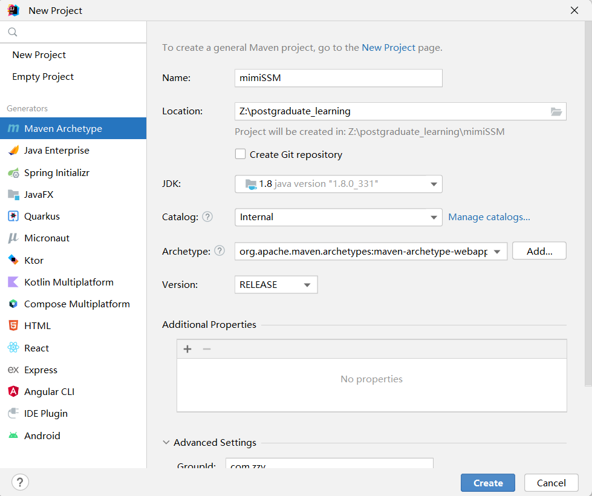
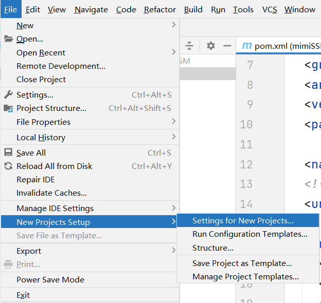
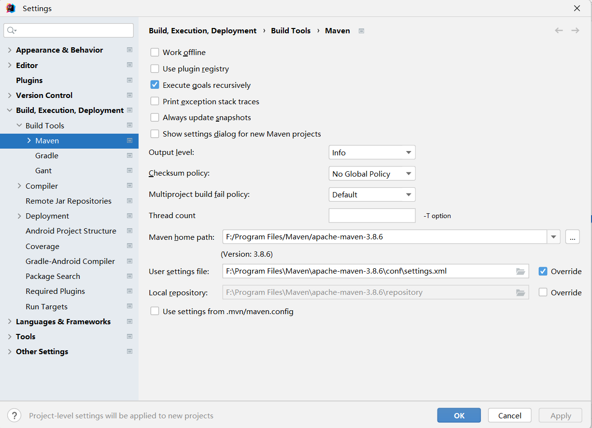
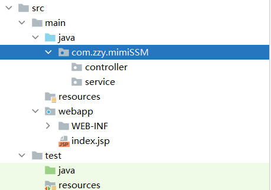
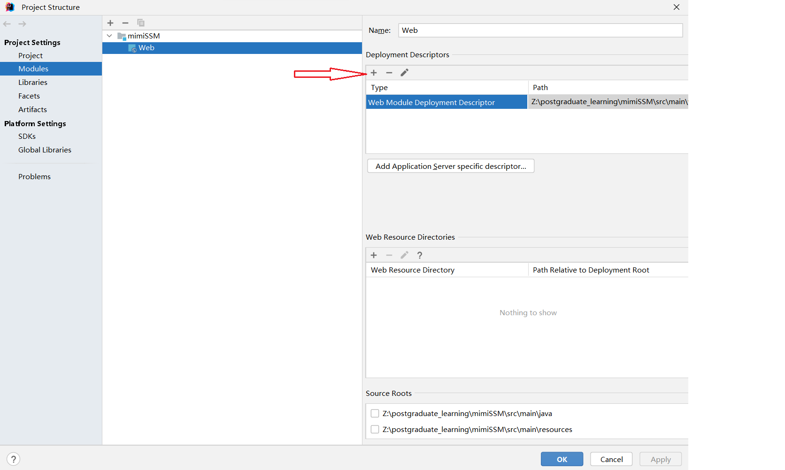

# 一、项目搭建

## 1、新建项目



> 在新项目中默认使用自己的 Maven：
>
> 
>
> 

## 2、修改目录



> pojo 类和 mapper 包使用 Mybatis 逆向工程自动生成。

## 3、使用最新的 `web.xml` 文件

首先删除原来的 `web.xml` 文件，再创建一个新的。



> 若不会见 https://www.bilibili.com/video/BV1hQ4y127T1 P9。

## 4、添加依赖，改造 `Pom.xml` 文件

```xml
<?xml version="1.0" encoding="UTF-8"?>

<project xmlns="http://maven.apache.org/POM/4.0.0" xmlns:xsi="http://www.w3.org/2001/XMLSchema-instance"
         xsi:schemaLocation="http://maven.apache.org/POM/4.0.0 http://maven.apache.org/xsd/maven-4.0.0.xsd">
    <modelVersion>4.0.0</modelVersion>

    <groupId>com.zzy</groupId>
    <artifactId>mimiSSM</artifactId>
    <version>1.0</version>
    <packaging>war</packaging>

    <!-- 集中定义依赖版本号 -->
    <properties>
        <junit.version>4.12</junit.version>
        <spring.version>5.2.5.RELEASE</spring.version>
        <mybatis.version>3.5.1</mybatis.version>
        <mybatis.spring.version>1.3.1</mybatis.spring.version>
        <mybatis.paginator.version>1.2.15</mybatis.paginator.version>
        <mysql.version>8.0.22</mysql.version>
        <slf4j.version>1.6.4</slf4j.version>
        <druid.version>1.1.12</druid.version>
        <pagehelper.version>5.1.2</pagehelper.version>
        <jstl.version>1.2</jstl.version>
        <servlet-api.version>3.0.1</servlet-api.version>
        <jsp-api.version>2.0</jsp-api.version>
        <jackson.version>2.9.6</jackson.version>
    </properties>


    <dependencies>
        <!-- spring -->
        <dependency>
            <groupId>org.springframework</groupId>
            <artifactId>spring-context</artifactId>
            <version>${spring.version}</version>
        </dependency>
        <dependency>
            <groupId>org.springframework</groupId>
            <artifactId>spring-beans</artifactId>
            <version>${spring.version}</version>
        </dependency>
        <dependency>
            <groupId>org.springframework</groupId>
            <artifactId>spring-webmvc</artifactId>
            <version>${spring.version}</version>
        </dependency>
        <dependency>
            <groupId>org.springframework</groupId>
            <artifactId>spring-jdbc</artifactId>
            <version>${spring.version}</version>
        </dependency>
        <dependency>
            <groupId>org.springframework</groupId>
            <artifactId>spring-aspects</artifactId>
            <version>${spring.version}</version>
        </dependency>
        <dependency>
            <groupId>org.springframework</groupId>
            <artifactId>spring-jms</artifactId>
            <version>${spring.version}</version>
        </dependency>
        <dependency>
            <groupId>org.springframework</groupId>
            <artifactId>spring-context-support</artifactId>
            <version>${spring.version}</version>
        </dependency>
        <dependency>
            <groupId>org.springframework</groupId>
            <artifactId>spring-test</artifactId>
            <version>${spring.version}</version>
        </dependency>
        <!-- Mybatis -->
        <dependency>
            <groupId>org.mybatis</groupId>
            <artifactId>mybatis</artifactId>
            <version>${mybatis.version}</version>
        </dependency>
        <dependency>
            <groupId>org.mybatis</groupId>
            <artifactId>mybatis-spring</artifactId>
            <version>${mybatis.spring.version}</version>
        </dependency>
        <dependency>
            <groupId>com.github.miemiedev</groupId>
            <artifactId>mybatis-paginator</artifactId>
            <version>${mybatis.paginator.version}</version>
        </dependency>
        <dependency>
            <groupId>com.github.pagehelper</groupId>
            <artifactId>pagehelper</artifactId>
            <version>${pagehelper.version}</version>
        </dependency>
        <!-- MySql -->
        <dependency>
            <groupId>mysql</groupId>
            <artifactId>mysql-connector-java</artifactId>
            <version>${mysql.version}</version>
        </dependency>
        <!-- 连接池 -->
        <dependency>
            <groupId>com.alibaba</groupId>
            <artifactId>druid</artifactId>
            <version>${druid.version}</version>
        </dependency>

        <!-- junit -->
        <dependency>
            <groupId>junit</groupId>
            <artifactId>junit</artifactId>
            <version>${junit.version}</version>
            <scope>test</scope>
        </dependency>


        <!-- JSP相关 -->
        <dependency>
            <groupId>jstl</groupId>
            <artifactId>jstl</artifactId>
            <version>${jstl.version}</version>
        </dependency>
        <dependency>
            <groupId>javax.servlet</groupId>
            <artifactId>javax.servlet-api</artifactId>
            <version>3.0.1</version>
            <scope>provided</scope>
        </dependency>
        <dependency>
            <groupId>javax.servlet</groupId>
            <artifactId>jsp-api</artifactId>
            <scope>provided</scope>
            <version>${jsp-api.version}</version>
        </dependency>
        <!-- Jackson Json处理工具包 -->
        <dependency>
            <groupId>com.fasterxml.jackson.core</groupId>
            <artifactId>jackson-databind</artifactId>
            <version>${jackson.version}</version>
        </dependency>
        <dependency>
            <groupId>org.json</groupId>
            <artifactId>json</artifactId>
            <version>20140107</version>
        </dependency>

        <!--    文件异步上传使用的依赖-->
        <dependency>
            <groupId>commons-io</groupId>
            <artifactId>commons-io</artifactId>
            <version>2.4</version>
        </dependency>
        <dependency>
            <groupId>commons-fileupload</groupId>
            <artifactId>commons-fileupload</artifactId>
            <version>1.3.1</version>
        </dependency>
    </dependencies>

    <!-- 插件配置 -->
    <build>
        <plugins>
            <plugin>
                <groupId>org.apache.maven.plugins</groupId>
                <artifactId>maven-compiler-plugin</artifactId>
                <configuration>
                    <source>1.8</source>
                    <target>1.8</target>
                    <encoding>UTF-8</encoding>
                </configuration>
            </plugin>
        </plugins>
        <!--识别所有的配置文件-->
        <resources>
            <resource>
                <directory>src/main/java</directory>
                <includes>
                    <include>**/*.properties</include>
                    <include>**/*.xml</include>
                </includes>
                <filtering>false</filtering>
            </resource>
            <resource>
                <directory>src/main/resources</directory>
                <includes>
                    <include>**/*.properties</include>
                    <include>**/*.xml</include>
                </includes>
                <filtering>false</filtering>
            </resource>
        </resources>
    </build>
</project>
```

## 5、jdbc.properties

```properties
jdbc.driver=com.mysql.cj.jdbc.Driver
jdbc.url=jdbc:mysql://localhost:3306/bjpowernode?useSSL=false&serverTimezone=Asia/Shanghai&allowPublicKeyRetrieval=true
jdbc.username=root
jdbc.password=991118
```

## 6、Mybatis 核心配置文件 `mybatis-config.xml`

```xml
<?xml version="1.0" encoding="UTF-8" ?>
<!DOCTYPE configuration
        PUBLIC "-//mybatis.org//DTD Config 3.0//EN"
        "https://mybatis.org/dtd/mybatis-3-config.dtd">
<configuration>
    <!--开启日志-->
    <settings>
        <setting name="logImpl" value="STDOUT_LOGGING"/>
    </settings>
    
    <!--分页插件配置-->
    <plugins>
        <plugin interceptor="com.github.pagehelper.PageInterceptor"></plugin>
    </plugins>
</configuration>
```

> Mybatis 会与 Spring 进行整合，核心配置文件中不需要有太多信息。

## 7、Spring 接管 Mybatis 配置 `applicationContext_dao.xml`

```xml
<?xml version="1.0" encoding="UTF-8"?>
<beans xmlns="http://www.springframework.org/schema/beans"
       xmlns:xsi="http://www.w3.org/2001/XMLSchema-instance"
       xmlns:context="http://www.springframework.org/schema/context"
       xsi:schemaLocation="http://www.springframework.org/schema/beans http://www.springframework.org/schema/beans/spring-beans.xsd http://www.springframework.org/schema/context https://www.springframework.org/schema/context/spring-context.xsd">

    <!--    读取jdbc.properties属性文件 -->
    <context:property-placeholder location="classpath:jdbc.properties"></context:property-placeholder>

    <!--    创建数据源-->
    <bean id="dataSource" class="com.alibaba.druid.pool.DruidDataSource">
        <property name="driverClassName" value="${jdbc.driver}"></property>
        <property name="url" value="${jdbc.url}"></property>
        <property name="username" value="${jdbc.username}"></property>
        <property name="password" value="${jdbc.password}"></property>
    </bean>

    <!--    创建SqlSessionFactoryBean-->
    <bean class="org.mybatis.spring.SqlSessionFactoryBean">
        <!--        配置数据源-->
        <property name="dataSource" ref="dataSource"></property>

        <!--        配置MyBatis的核心配置文件 -->
        <property name="configLocation" value="classpath:mybatis-config.xml"></property>

        <!--        给实体类设置别名-->
        <property name="typeAliasesPackage" value="com.zzy.mimiSSM.pojo"></property>
    </bean>
    <!--    创建mapper文件的扫描器-->
    <bean class="org.mybatis.spring.mapper.MapperScannerConfigurer">
        <property name="basePackage" value="com.zzy.mimiSSM.mapper"></property>
    </bean>
</beans>
```

## 8、Spring Service 层配置 `applicationContext_service.xml`

```xml
<?xml version="1.0" encoding="UTF-8"?>
<beans xmlns="http://www.springframework.org/schema/beans"
       xmlns:xsi="http://www.w3.org/2001/XMLSchema-instance"
       xmlns:context="http://www.springframework.org/schema/context" xmlns:tx="http://www.springframework.org/schema/tx"
       xmlns:aop="http://www.springframework.org/schema/aop"
       xsi:schemaLocation="http://www.springframework.org/schema/beans http://www.springframework.org/schema/beans/spring-beans.xsd http://www.springframework.org/schema/context https://www.springframework.org/schema/context/spring-context.xsd http://www.springframework.org/schema/tx http://www.springframework.org/schema/tx/spring-tx.xsd http://www.springframework.org/schema/aop https://www.springframework.org/schema/aop/spring-aop.xsd">
    <!--<import resource="classpath:applicationContext_dao.xml"></import>-->
    <!--    设置业务逻辑层的包扫描器,目的是在指定的路径下,使用@Service注解的类,Spring负责创建对象,并添加依赖-->
    <context:component-scan base-package="com.zzy.mimiSSM.controller"></context:component-scan>
    <!--    设置事务管理器-->
    <bean id="transactionManager" class="org.springframework.jdbc.datasource.DataSourceTransactionManager">
        <property name="dataSource" ref="dataSource"></property>
    </bean>

    <!--    添加事务的切面-->
    <tx:advice id="myadvice" transaction-manager="transactionManager">
        <tx:attributes>
            <tx:method name="*select*" read-only="true"/>
            <tx:method name="*find*" read-only="true"/>
            <tx:method name="*get*" read-only="true"/>
            <tx:method name="*search*" read-only="true"/>
            <tx:method name="*insert*" propagation="REQUIRED"/>
            <tx:method name="*save*" propagation="REQUIRED"/>
            <tx:method name="*add*" propagation="REQUIRED"/>
            <tx:method name="*delete*" propagation="REQUIRED"/>
            <tx:method name="*remove*" propagation="REQUIRED"/>
            <tx:method name="*clear*" propagation="REQUIRED"/>
            <tx:method name="*update*" propagation="REQUIRED"/>
            <tx:method name="*modify*" propagation="REQUIRED"/>
            <tx:method name="*change*" propagation="REQUIRED"/>
            <tx:method name="*set*" propagation="REQUIRED"/>
            <tx:method name="*" propagation="SUPPORTS"/>
        </tx:attributes>
    </tx:advice>

    <!--    完成切面和切入点的织入-->
    <aop:config>
        <aop:pointcut id="mypointcut" expression="execution(* com.zzy.mimiSSM.service.*.*(..))"/>
        <aop:advisor advice-ref="myadvice" pointcut-ref="mypointcut"></aop:advisor>
    </aop:config>
</beans>
```

## 9、Spring Controller 层配置 `springmvc.xml`

```xml
<?xml version="1.0" encoding="UTF-8"?>
<beans xmlns="http://www.springframework.org/schema/beans"
       xmlns:xsi="http://www.w3.org/2001/XMLSchema-instance"
       xmlns:context="http://www.springframework.org/schema/context"
       xmlns:mvc="http://www.springframework.org/schema/mvc"
       xsi:schemaLocation="http://www.springframework.org/schema/beans http://www.springframework.org/schema/beans/spring-beans.xsd http://www.springframework.org/schema/context https://www.springframework.org/schema/context/spring-context.xsd http://www.springframework.org/schema/mvc https://www.springframework.org/schema/mvc/spring-mvc.xsd">

    <!--    设置包扫描器-->
    <context:component-scan base-package="com.zzy.mimiSSM.controller"></context:component-scan>

    <!--    设置视图解析器   /admin/     main    .jsp  -->
    <bean id="viewResolver" class="org.springframework.web.servlet.view.InternalResourceViewResolver">
        <property name="prefix" value="/admin/"></property>
        <property name="suffix" value=".jsp"></property>
    </bean>

    <!--    设置文件上传核心组件-->
    <bean id="multipartResolver" class="org.springframework.web.multipart.commons.CommonsMultipartResolver">
    </bean>

    <!--    设置注解驱动-->
    <mvc:annotation-driven></mvc:annotation-driven>
</beans>
```

## 10、在 `web.xml` 中进行字符编码过滤器设置、`DispatcherServlet` 和 Spring 框架注册

```xml
<?xml version="1.0" encoding="UTF-8"?>
<web-app xmlns="http://xmlns.jcp.org/xml/ns/javaee"
         xmlns:xsi="http://www.w3.org/2001/XMLSchema-instance"
         xsi:schemaLocation="http://xmlns.jcp.org/xml/ns/javaee http://xmlns.jcp.org/xml/ns/javaee/web-app_4_0.xsd"
         version="4.0">

    <!--    添加字符编码过滤器-->
    <filter>
        <filter-name>encode</filter-name>
        <filter-class>org.springframework.web.filter.CharacterEncodingFilter</filter-class>
        <init-param>
            <param-name>encoding</param-name>
            <param-value>UTF-8</param-value>
        </init-param>
        <init-param>
            <param-name>forceRequestEncoding</param-name>
            <param-value>true</param-value>
        </init-param>
        <init-param>
            <param-name>forceResponseEncoding</param-name>
            <param-value>true</param-value>
        </init-param>
    </filter>
    <filter-mapping>
        <filter-name>encode</filter-name>
        <url-pattern>/*</url-pattern>
    </filter-mapping>

    <!--    注册SpringMVC框架-->
    <servlet>
        <servlet-name>springmvc</servlet-name>
        <servlet-class>org.springframework.web.servlet.DispatcherServlet</servlet-class>
        <init-param>
            <param-name>contextConfigLocation</param-name>
            <param-value>classpath:springmvc.xml</param-value>
        </init-param>
    </servlet>
    <servlet-mapping>
        <!--
              /admin/login.action
              /admin/main.jsp
        -->
        <servlet-name>springmvc</servlet-name>
        <url-pattern>*.action</url-pattern>
    </servlet-mapping>

    <!--    注册Spring框架-->
    <listener>
        <listener-class>org.springframework.web.context.ContextLoaderListener</listener-class>
    </listener>
    <context-param>
        <param-name>contextConfigLocation</param-name>
        <param-value>classpath:applicationContext_*.xml</param-value>
    </context-param>
    <welcome-file-list>
        <welcome-file>/admin/login.jsp</welcome-file>
    </welcome-file-list>
</web-app>
```

完成以上工作，SSM 框架就搭建完成了。

## 11、测试 mapper

```java
@RunWith(SpringJUnit4ClassRunner.class)
@ContextConfiguration("classpath:applicationContext_dao.xml")
public class AccountMapperTest {
    @Autowired
    private AccountMapper accountMapper;

    @Test
    public void testInsert() {
        Account account = new Account(null, "004", BigDecimal.valueOf(1000));
        int count = accountMapper.insert(account);
        System.out.println(count > 0 ? "插入成功！" : "插入失败！");
    }
}
```
